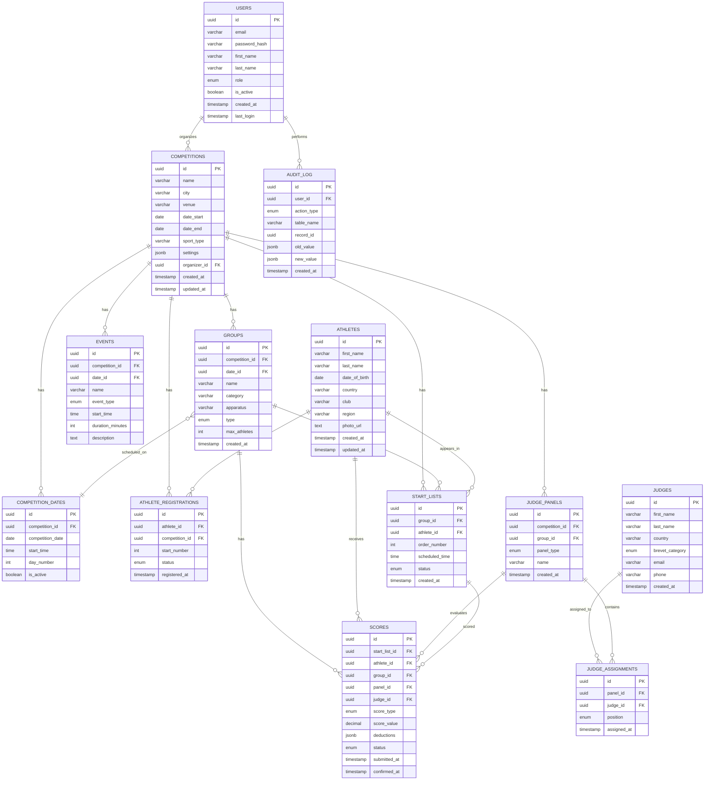

# Схема базы данных
## Система управления соревнованиями по художественной гимнастике

> **Версия:** 1.0
> **Дата:** 2025-11-26
> **СУБД:** PostgreSQL 14+ (рекомендуется) или MySQL 8.0+

---

## Содержание

1. [ER-диаграмма](#er-диаграмма)
2. [Таблицы](#таблицы)
3. [Индексы](#индексы)
4. [Триггеры](#триггеры)
5. [Представления (Views)](#представления-views)
6. [Примеры запросов](#примеры-запросов)

---

## ER-диаграмма

### Полная диаграмма сущностей



---

## Таблицы

### 1. COMPETITIONS (Соревнования)

**Описание:** Основная таблица соревнований.

```sql
CREATE TABLE competitions (
    id UUID PRIMARY KEY DEFAULT gen_random_uuid(),
    name VARCHAR(255) NOT NULL,
    city VARCHAR(100) NOT NULL,
    venue VARCHAR(255) NOT NULL,
    address TEXT,
    date_start DATE NOT NULL,
    date_end DATE NOT NULL,
    sport_type VARCHAR(50) DEFAULT 'Rhythmic Gymnastics',

    -- Организаторы и ответственные лица
    organizer VARCHAR(255),
    chief_judge_id UUID REFERENCES judges(id),
    chief_secretary_id UUID REFERENCES users(id),
    technical_specialist_id UUID REFERENCES users(id),

    -- Контактная информация
    email VARCHAR(100),
    phone VARCHAR(20),
    website VARCHAR(255),

    -- Настройки регламента (JSON)
    settings JSONB DEFAULT '{
        "individual": {
            "routine_time": 90,
            "warmup_time": 30
        },
        "group": {
            "routine_time": 150,
            "warmup_time": 60
        },
        "breaks": {
            "between_routines": 3,
            "technical": 15,
            "lunch": 60
        }
    }'::JSONB,

    -- Статус
    status VARCHAR(20) DEFAULT 'draft' CHECK (status IN ('draft', 'active', 'completed', 'archived')),

    -- Метаданные
    created_by UUID REFERENCES users(id),
    created_at TIMESTAMP DEFAULT CURRENT_TIMESTAMP,
    updated_at TIMESTAMP DEFAULT CURRENT_TIMESTAMP,

    -- Ограничения
    CONSTRAINT valid_dates CHECK (date_end >= date_start)
);

-- Индексы
CREATE INDEX idx_competitions_dates ON competitions(date_start, date_end);
CREATE INDEX idx_competitions_status ON competitions(status);
CREATE INDEX idx_competitions_organizer ON competitions(created_by);
```

---

### 2. COMPETITION_DATES (Даты соревнований)

**Описание:** Дни проведения соревнования.

```sql
CREATE TABLE competition_dates (
    id UUID PRIMARY KEY DEFAULT gen_random_uuid(),
    competition_id UUID NOT NULL REFERENCES competitions(id) ON DELETE CASCADE,
    competition_date DATE NOT NULL,
    start_time TIME DEFAULT '09:00:00',
    day_number INT NOT NULL,
    is_active BOOLEAN DEFAULT TRUE,

    -- Метаданные
    created_at TIMESTAMP DEFAULT CURRENT_TIMESTAMP,

    -- Ограничения
    UNIQUE(competition_id, competition_date),
    UNIQUE(competition_id, day_number)
);

-- Индексы
CREATE INDEX idx_comp_dates_competition ON competition_dates(competition_id);
CREATE INDEX idx_comp_dates_date ON competition_dates(competition_date);
```

---

### 3. GROUPS (Группы/Потоки)

**Описание:** Категории и потоки соревнований.

```sql
CREATE TABLE groups (
    id UUID PRIMARY KEY DEFAULT gen_random_uuid(),
    competition_id UUID NOT NULL REFERENCES competitions(id) ON DELETE CASCADE,
    date_id UUID REFERENCES competition_dates(id) ON DELETE SET NULL,

    name VARCHAR(255) NOT NULL,
    category VARCHAR(50) NOT NULL, -- 'Senior', 'Junior', 'Youth', 'Pre-Junior'
    apparatus VARCHAR(50), -- 'Rope', 'Hoop', 'Ball', 'Clubs', 'Ribbon', 'All-Around'

    type VARCHAR(20) CHECK (type IN ('individual', 'group')),

    -- Настройки
    max_athletes INT DEFAULT 100,
    scheduled_time TIME,

    -- Метаданные
    created_at TIMESTAMP DEFAULT CURRENT_TIMESTAMP,
    updated_at TIMESTAMP DEFAULT CURRENT_TIMESTAMP
);

-- Индексы
CREATE INDEX idx_groups_competition ON groups(competition_id);
CREATE INDEX idx_groups_date ON groups(date_id);
CREATE INDEX idx_groups_category ON groups(category);
```

---

### 4. ATHLETES (Спортсмены)

**Описание:** База данных гимнасток.

```sql
CREATE TABLE athletes (
    id UUID PRIMARY KEY DEFAULT gen_random_uuid(),

    -- Основные данные
    first_name VARCHAR(100) NOT NULL,
    last_name VARCHAR(100) NOT NULL,
    date_of_birth DATE NOT NULL,

    -- Принадлежность
    country VARCHAR(3), -- ISO 3166-1 alpha-3 (RUS, USA, etc.)
    club VARCHAR(255),
    region VARCHAR(100),

    -- Дополнительно
    photo_url TEXT,
    notes TEXT,

    -- Метаданные
    created_at TIMESTAMP DEFAULT CURRENT_TIMESTAMP,
    updated_at TIMESTAMP DEFAULT CURRENT_TIMESTAMP
);

-- Индексы
CREATE INDEX idx_athletes_name ON athletes(last_name, first_name);
CREATE INDEX idx_athletes_country ON athletes(country);
CREATE INDEX idx_athletes_club ON athletes(club);
```

---

### 5. ATHLETE_REGISTRATIONS (Регистрации на соревнование)

**Описание:** Связь спортсменов и соревнований.

```sql
CREATE TABLE athlete_registrations (
    id UUID PRIMARY KEY DEFAULT gen_random_uuid(),
    athlete_id UUID NOT NULL REFERENCES athletes(id) ON DELETE CASCADE,
    competition_id UUID NOT NULL REFERENCES competitions(id) ON DELETE CASCADE,

    start_number INT NOT NULL,

    status VARCHAR(20) DEFAULT 'registered' CHECK (status IN (
        'registered', 'confirmed', 'withdrawn', 'disqualified'
    )),

    -- Метаданные
    registered_at TIMESTAMP DEFAULT CURRENT_TIMESTAMP,

    -- Ограничения
    UNIQUE(competition_id, start_number),
    UNIQUE(athlete_id, competition_id)
);

-- Индексы
CREATE INDEX idx_reg_athlete ON athlete_registrations(athlete_id);
CREATE INDEX idx_reg_competition ON athlete_registrations(competition_id);
CREATE INDEX idx_reg_start_number ON athlete_registrations(competition_id, start_number);
```

---

### 6. START_LISTS (Стартовые протоколы)

**Описание:** Порядок выступлений в группе.

```sql
CREATE TABLE start_lists (
    id UUID PRIMARY KEY DEFAULT gen_random_uuid(),
    group_id UUID NOT NULL REFERENCES groups(id) ON DELETE CASCADE,
    athlete_id UUID NOT NULL REFERENCES athletes(id) ON DELETE CASCADE,

    order_number INT NOT NULL,
    scheduled_time TIME,

    status VARCHAR(20) DEFAULT 'scheduled' CHECK (status IN (
        'scheduled', 'warming_up', 'performing', 'completed', 'dns'
    )),

    -- Метаданные
    created_at TIMESTAMP DEFAULT CURRENT_TIMESTAMP,

    -- Ограничения
    UNIQUE(group_id, order_number),
    UNIQUE(group_id, athlete_id)
);

-- Индексы
CREATE INDEX idx_start_list_group ON start_lists(group_id);
CREATE INDEX idx_start_list_athlete ON start_lists(athlete_id);
CREATE INDEX idx_start_list_order ON start_lists(group_id, order_number);
```

---

### 7. JUDGES (Судьи)

**Описание:** База данных судей.

```sql
CREATE TABLE judges (
    id UUID PRIMARY KEY DEFAULT gen_random_uuid(),

    -- Основные данные
    first_name VARCHAR(100) NOT NULL,
    last_name VARCHAR(100) NOT NULL,
    country VARCHAR(3), -- ISO 3166-1 alpha-3

    -- Квалификация
    brevet_category VARCHAR(10) CHECK (brevet_category IN ('1', '2', '3', '4', '5')),

    -- Контакты
    email VARCHAR(100),
    phone VARCHAR(20),

    -- Статус
    is_active BOOLEAN DEFAULT TRUE,

    -- Метаданные
    created_at TIMESTAMP DEFAULT CURRENT_TIMESTAMP,
    updated_at TIMESTAMP DEFAULT CURRENT_TIMESTAMP
);

-- Индексы
CREATE INDEX idx_judges_name ON judges(last_name, first_name);
CREATE INDEX idx_judges_country ON judges(country);
CREATE INDEX idx_judges_brevet ON judges(brevet_category);
```

---

### 8. JUDGE_PANELS (Судейские бригады)

**Описание:** Судейские бригады для групп.

```sql
CREATE TABLE judge_panels (
    id UUID PRIMARY KEY DEFAULT gen_random_uuid(),
    competition_id UUID NOT NULL REFERENCES competitions(id) ON DELETE CASCADE,
    group_id UUID REFERENCES groups(id) ON DELETE CASCADE,

    panel_type VARCHAR(1) CHECK (panel_type IN ('D', 'E', 'A')),
    name VARCHAR(100),

    -- Метаданные
    created_at TIMESTAMP DEFAULT CURRENT_TIMESTAMP
);

-- Индексы
CREATE INDEX idx_panels_competition ON judge_panels(competition_id);
CREATE INDEX idx_panels_group ON judge_panels(group_id);
CREATE INDEX idx_panels_type ON judge_panels(panel_type);
```

---

### 9. JUDGE_ASSIGNMENTS (Назначение судей на бригады)

**Описание:** Связь судей и бригад.

```sql
CREATE TABLE judge_assignments (
    id UUID PRIMARY KEY DEFAULT gen_random_uuid(),
    panel_id UUID NOT NULL REFERENCES judge_panels(id) ON DELETE CASCADE,
    judge_id UUID NOT NULL REFERENCES judges(id) ON DELETE CASCADE,

    position INT NOT NULL, -- 1, 2, 3, 4 (порядковый номер в бригаде)

    -- Метаданные
    assigned_at TIMESTAMP DEFAULT CURRENT_TIMESTAMP,

    -- Ограничения
    UNIQUE(panel_id, judge_id),
    UNIQUE(panel_id, position)
);

-- Индексы
CREATE INDEX idx_assignments_panel ON judge_assignments(panel_id);
CREATE INDEX idx_assignments_judge ON judge_assignments(judge_id);
```

---

### 10. SCORES (Оценки)

**Описание:** Оценки судей и итоговые баллы.

```sql
CREATE TABLE scores (
    id UUID PRIMARY KEY DEFAULT gen_random_uuid(),

    -- Ссылки
    start_list_id UUID NOT NULL REFERENCES start_lists(id) ON DELETE CASCADE,
    athlete_id UUID NOT NULL REFERENCES athletes(id) ON DELETE CASCADE,
    group_id UUID NOT NULL REFERENCES groups(id) ON DELETE CASCADE,
    panel_id UUID NOT NULL REFERENCES judge_panels(id) ON DELETE CASCADE,
    judge_id UUID REFERENCES judges(id) ON DELETE SET NULL, -- NULL для итоговых оценок

    -- Тип оценки
    score_type VARCHAR(20) CHECK (score_type IN (
        'D', 'E', 'A', 'ND', 'final'
    )),

    -- Значение
    score_value DECIMAL(5, 3) NOT NULL, -- Пример: 9.450

    -- Детали (JSON)
    deductions JSONB, -- Для E-панели: список сбавок

    -- Статус
    status VARCHAR(20) DEFAULT 'draft' CHECK (status IN (
        'draft', 'submitted', 'confirmed', 'rejected'
    )),

    -- Метаданные
    submitted_at TIMESTAMP DEFAULT CURRENT_TIMESTAMP,
    confirmed_at TIMESTAMP,
    confirmed_by UUID REFERENCES users(id)
);

-- Индексы
CREATE INDEX idx_scores_start_list ON scores(start_list_id);
CREATE INDEX idx_scores_athlete ON scores(athlete_id);
CREATE INDEX idx_scores_group ON scores(group_id);
CREATE INDEX idx_scores_panel ON scores(panel_id);
CREATE INDEX idx_scores_type ON scores(score_type);
CREATE INDEX idx_scores_status ON scores(status);
```

---

### 11. EVENTS (События)

**Описание:** События соревнования (открытие, перерывы, награждение).

```sql
CREATE TABLE events (
    id UUID PRIMARY KEY DEFAULT gen_random_uuid(),
    competition_id UUID NOT NULL REFERENCES competitions(id) ON DELETE CASCADE,
    date_id UUID NOT NULL REFERENCES competition_dates(id) ON DELETE CASCADE,

    name VARCHAR(255) NOT NULL,
    event_type VARCHAR(50) CHECK (event_type IN (
        'opening', 'podium_training', 'ceremony', 'break', 'other'
    )),

    start_time TIME NOT NULL,
    duration_minutes INT DEFAULT 30,

    description TEXT,

    -- Метаданные
    created_at TIMESTAMP DEFAULT CURRENT_TIMESTAMP
);

-- Индексы
CREATE INDEX idx_events_competition ON events(competition_id);
CREATE INDEX idx_events_date ON events(date_id);
CREATE INDEX idx_events_type ON events(event_type);
```

---

### 12. USERS (Пользователи системы)

**Описание:** Пользователи для входа в систему.

```sql
CREATE TABLE users (
    id UUID PRIMARY KEY DEFAULT gen_random_uuid(),

    -- Аутентификация
    email VARCHAR(100) UNIQUE NOT NULL,
    password_hash VARCHAR(255) NOT NULL,

    -- Основные данные
    first_name VARCHAR(100) NOT NULL,
    last_name VARCHAR(100) NOT NULL,

    -- Роль
    role VARCHAR(50) CHECK (role IN (
        'admin', 'organizer', 'chief_judge', 'secretary', 'judge', 'viewer'
    )),

    -- Статус
    is_active BOOLEAN DEFAULT TRUE,

    -- Метаданные
    created_at TIMESTAMP DEFAULT CURRENT_TIMESTAMP,
    last_login TIMESTAMP
);

-- Индексы
CREATE INDEX idx_users_email ON users(email);
CREATE INDEX idx_users_role ON users(role);
```

---

### 13. AUDIT_LOG (Журнал аудита)

**Описание:** Логирование всех действий в системе.

```sql
CREATE TABLE audit_log (
    id UUID PRIMARY KEY DEFAULT gen_random_uuid(),
    user_id UUID REFERENCES users(id) ON DELETE SET NULL,

    action_type VARCHAR(50) NOT NULL, -- CREATE, UPDATE, DELETE, LOGIN, etc.
    table_name VARCHAR(50),
    record_id UUID,

    old_value JSONB,
    new_value JSONB,

    ip_address INET,
    user_agent TEXT,

    created_at TIMESTAMP DEFAULT CURRENT_TIMESTAMP
);

-- Индексы
CREATE INDEX idx_audit_user ON audit_log(user_id);
CREATE INDEX idx_audit_action ON audit_log(action_type);
CREATE INDEX idx_audit_table ON audit_log(table_name);
CREATE INDEX idx_audit_created ON audit_log(created_at DESC);
```

---

## Индексы

### Сводка всех индексов

```sql
-- Индексы для производительности
CREATE INDEX CONCURRENTLY idx_scores_final ON scores(group_id, score_type) WHERE score_type = 'final';
CREATE INDEX CONCURRENTLY idx_scores_confirmed ON scores(status) WHERE status = 'confirmed';

-- Составные индексы для частых запросов
CREATE INDEX idx_start_list_performance ON start_lists(group_id, order_number, status);
CREATE INDEX idx_athlete_competition ON athlete_registrations(athlete_id, competition_id);

-- Полнотекстовый поиск (PostgreSQL)
CREATE INDEX idx_athletes_fulltext ON athletes USING GIN (
    to_tsvector('russian', first_name || ' ' || last_name)
);

CREATE INDEX idx_competitions_fulltext ON competitions USING GIN (
    to_tsvector('russian', name || ' ' || city || ' ' || venue)
);
```

---

## Триггеры

### 1. Автоматическое обновление `updated_at`

```sql
CREATE OR REPLACE FUNCTION update_updated_at_column()
RETURNS TRIGGER AS $$
BEGIN
    NEW.updated_at = CURRENT_TIMESTAMP;
    RETURN NEW;
END;
$$ LANGUAGE plpgsql;

-- Применение к таблицам
CREATE TRIGGER update_competitions_updated_at BEFORE UPDATE ON competitions
    FOR EACH ROW EXECUTE FUNCTION update_updated_at_column();

CREATE TRIGGER update_athletes_updated_at BEFORE UPDATE ON athletes
    FOR EACH ROW EXECUTE FUNCTION update_updated_at_column();

CREATE TRIGGER update_groups_updated_at BEFORE UPDATE ON groups
    FOR EACH ROW EXECUTE FUNCTION update_updated_at_column();
```

---

### 2. Автоматическое логирование в audit_log

```sql
CREATE OR REPLACE FUNCTION log_audit()
RETURNS TRIGGER AS $$
BEGIN
    IF TG_OP = 'DELETE' THEN
        INSERT INTO audit_log (action_type, table_name, record_id, old_value)
        VALUES ('DELETE', TG_TABLE_NAME, OLD.id, row_to_json(OLD));
        RETURN OLD;
    ELSIF TG_OP = 'UPDATE' THEN
        INSERT INTO audit_log (action_type, table_name, record_id, old_value, new_value)
        VALUES ('UPDATE', TG_TABLE_NAME, NEW.id, row_to_json(OLD), row_to_json(NEW));
        RETURN NEW;
    ELSIF TG_OP = 'INSERT' THEN
        INSERT INTO audit_log (action_type, table_name, record_id, new_value)
        VALUES ('INSERT', TG_TABLE_NAME, NEW.id, row_to_json(NEW));
        RETURN NEW;
    END IF;
END;
$$ LANGUAGE plpgsql;

-- Применение к критическим таблицам
CREATE TRIGGER audit_competitions AFTER INSERT OR UPDATE OR DELETE ON competitions
    FOR EACH ROW EXECUTE FUNCTION log_audit();

CREATE TRIGGER audit_scores AFTER INSERT OR UPDATE OR DELETE ON scores
    FOR EACH ROW EXECUTE FUNCTION log_audit();
```

---

### 3. Валидация уникальности стартовых номеров

```sql
CREATE OR REPLACE FUNCTION check_start_number_unique()
RETURNS TRIGGER AS $$
BEGIN
    IF EXISTS (
        SELECT 1 FROM athlete_registrations
        WHERE competition_id = NEW.competition_id
          AND start_number = NEW.start_number
          AND id != NEW.id
    ) THEN
        RAISE EXCEPTION 'Start number % already exists for this competition', NEW.start_number;
    END IF;
    RETURN NEW;
END;
$$ LANGUAGE plpgsql;

CREATE TRIGGER check_start_number BEFORE INSERT OR UPDATE ON athlete_registrations
    FOR EACH ROW EXECUTE FUNCTION check_start_number_unique();
```

---

## Представления (Views)

### 1. Итоговые результаты (Final Results)

```sql
CREATE VIEW final_results AS
SELECT
    sl.id AS start_list_id,
    a.id AS athlete_id,
    a.first_name,
    a.last_name,
    a.country,
    a.club,
    g.id AS group_id,
    g.name AS group_name,
    g.category,
    g.apparatus,
    ar.start_number,

    -- Оценки
    MAX(CASE WHEN s.score_type = 'D' THEN s.score_value END) AS d_score,
    MAX(CASE WHEN s.score_type = 'E' THEN s.score_value END) AS e_score,
    MAX(CASE WHEN s.score_type = 'A' THEN s.score_value END) AS a_score,
    MAX(CASE WHEN s.score_type = 'ND' THEN s.score_value END) AS neutral_deductions,
    MAX(CASE WHEN s.score_type = 'final' THEN s.score_value END) AS final_score,

    -- Место
    RANK() OVER (PARTITION BY g.id ORDER BY MAX(CASE WHEN s.score_type = 'final' THEN s.score_value END) DESC) AS rank

FROM start_lists sl
JOIN athletes a ON sl.athlete_id = a.id
JOIN groups g ON sl.group_id = g.id
JOIN athlete_registrations ar ON ar.athlete_id = a.id AND ar.competition_id = g.competition_id
LEFT JOIN scores s ON s.start_list_id = sl.id AND s.status = 'confirmed'
GROUP BY sl.id, a.id, g.id, ar.start_number
ORDER BY g.name, rank;
```

---

### 2. Статус судейства

```sql
CREATE VIEW judging_status AS
SELECT
    g.id AS group_id,
    g.name AS group_name,
    COUNT(DISTINCT sl.id) AS total_athletes,
    COUNT(DISTINCT CASE WHEN s.status = 'confirmed' THEN sl.id END) AS scored_athletes,
    ROUND(
        100.0 * COUNT(DISTINCT CASE WHEN s.status = 'confirmed' THEN sl.id END) /
        NULLIF(COUNT(DISTINCT sl.id), 0),
        2
    ) AS completion_percentage
FROM groups g
LEFT JOIN start_lists sl ON sl.group_id = g.id
LEFT JOIN scores s ON s.start_list_id = sl.id AND s.score_type = 'final'
GROUP BY g.id, g.name;
```

---

## Примеры запросов

### 1. Получить итоговые результаты группы

```sql
SELECT * FROM final_results
WHERE group_id = '550e8400-e29b-41d4-a716-446655440000'
ORDER BY rank;
```

---

### 2. Топ-3 спортсменок соревнования

```sql
SELECT
    a.first_name,
    a.last_name,
    a.country,
    SUM(CASE WHEN s.score_type = 'final' THEN s.score_value ELSE 0 END) AS total_score
FROM athletes a
JOIN athlete_registrations ar ON ar.athlete_id = a.id
JOIN start_lists sl ON sl.athlete_id = a.id
JOIN scores s ON s.start_list_id = sl.id
WHERE ar.competition_id = '550e8400-e29b-41d4-a716-446655440000'
  AND s.status = 'confirmed'
GROUP BY a.id
ORDER BY total_score DESC
LIMIT 3;
```

---

### 3. Найти дубликаты оценок (ничья)

```sql
WITH ranked_scores AS (
    SELECT
        group_id,
        athlete_id,
        final_score,
        rank
    FROM final_results
    WHERE final_score IS NOT NULL
)
SELECT
    r1.group_id,
    r1.rank,
    r1.final_score,
    COUNT(*) AS tied_count
FROM ranked_scores r1
GROUP BY r1.group_id, r1.rank, r1.final_score
HAVING COUNT(*) > 1;
```

---

**Конец документа**

> **Рекомендации:**
> - Использовать UUID для всех первичных ключей
> - Включить репликацию для надёжности
> - Настроить регулярные бэкапы (каждые 6 часов)
> - Использовать pg_stat_statements для мониторинга запросов
