# Диаграммы системы
## Система управления соревнованиями по художественной гимнастике

> **Версия:** 1.0
> **Дата:** 2025-11-26
> **Формат:** Mermaid

---

## Содержание

1. [Архитектура системы](#архитектура-системы)
2. [Диаграммы последовательности](#диаграммы-последовательности)
3. [Диаграммы состояний](#диаграммы-состояний)
4. [Диаграммы компонентов](#диаграммы-компонентов)
5. [Диаграммы развертывания](#диаграммы-развертывания)

---

## Архитектура системы

### Общая архитектура

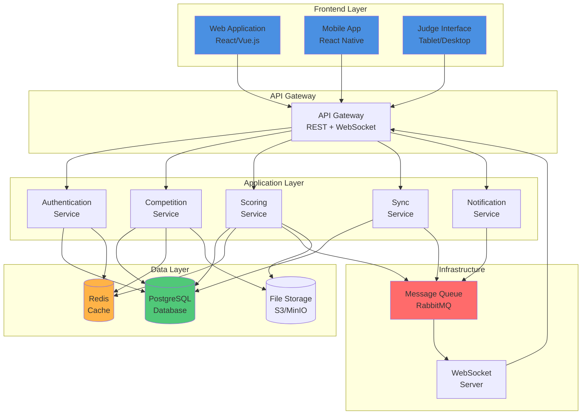
```mermaid
graph TB
    subgraph "Frontend Layer"
        WEB[Web Application<br/>React/Vue.js]
        MOBILE[Mobile App<br/>React Native]
        JUDGE[Judge Interface<br/>Tablet/Desktop]
    end

    subgraph "API Gateway"
        GATEWAY[API Gateway<br/>REST + WebSocket]
    end

    subgraph "Application Layer"
        AUTH[Authentication<br/>Service]
        COMP[Competition<br/>Service]
        SCORE[Scoring<br/>Service]
        SYNC[Sync<br/>Service]
        NOTIF[Notification<br/>Service]
    end

    subgraph "Data Layer"
        DB[(PostgreSQL<br/>Database)]
        CACHE[(Redis<br/>Cache)]
        STORAGE[(File Storage<br/>S3/MinIO)]
    end

    subgraph "Infrastructure"
        QUEUE[Message Queue<br/>RabbitMQ]
        WS[WebSocket<br/>Server]
    end

    WEB --> GATEWAY
    MOBILE --> GATEWAY
    JUDGE --> GATEWAY

    GATEWAY --> AUTH
    GATEWAY --> COMP
    GATEWAY --> SCORE
    GATEWAY --> SYNC
    GATEWAY --> NOTIF

    AUTH --> DB
    COMP --> DB
    SCORE --> DB
    SYNC --> DB

    AUTH --> CACHE
    COMP --> CACHE
    SCORE --> CACHE

    NOTIF --> QUEUE
    SCORE --> QUEUE
    SYNC --> QUEUE

    QUEUE --> WS
    WS --> GATEWAY

    COMP --> STORAGE
    SCORE --> STORAGE

    style WEB fill:#4A90E2
    style MOBILE fill:#4A90E2
    style JUDGE fill:#4A90E2
    style DB fill:#50C878
    style CACHE fill:#FFB347
    style QUEUE fill:#FF6B6B
```

---

### Архитектура локальной сети

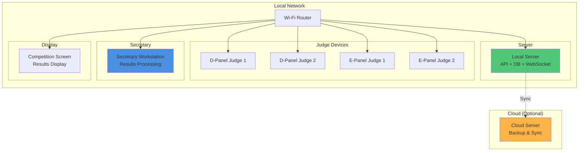
```mermaid
graph TB
    subgraph "Local Network"
        ROUTER[Wi-Fi Router]

        subgraph "Server"
            SERVER[Local Server<br/>API + DB + WebSocket]
        end

        subgraph "Judge Devices"
            J1[D-Panel Judge 1]
            J2[D-Panel Judge 2]
            J3[E-Panel Judge 1]
            J4[E-Panel Judge 2]
        end

        subgraph "Secretary"
            SEC[Secretary Workstation<br/>Results Processing]
        end

        subgraph "Display"
            SCREEN[Competition Screen<br/>Results Display]
        end
    end

    subgraph "Cloud (Optional)"
        CLOUD[Cloud Server<br/>Backup & Sync]
    end

    ROUTER --> SERVER
    ROUTER --> J1
    ROUTER --> J2
    ROUTER --> J3
    ROUTER --> J4
    ROUTER --> SEC
    ROUTER --> SCREEN

    SERVER -.Sync.-> CLOUD

    style SERVER fill:#50C878
    style SEC fill:#4A90E2
    style CLOUD fill:#FFB347
```

---

## Диаграммы последовательности

### 1. Создание соревнования

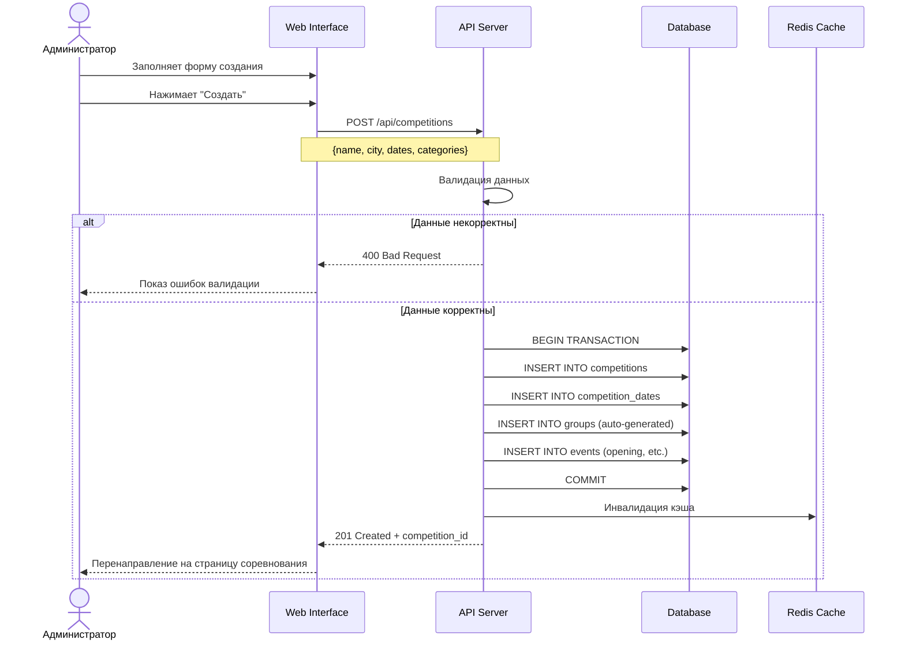
```mermaid
sequenceDiagram
    actor Admin as Администратор
    participant UI as Web Interface
    participant API as API Server
    participant DB as Database
    participant Cache as Redis Cache

    Admin->>UI: Заполняет форму создания
    Admin->>UI: Нажимает "Создать"

    UI->>API: POST /api/competitions
    Note over UI,API: {name, city, dates, categories}

    API->>API: Валидация данных
    alt Данные некорректны
        API-->>UI: 400 Bad Request
        UI-->>Admin: Показ ошибок валидации
    else Данные корректны
        API->>DB: BEGIN TRANSACTION
        API->>DB: INSERT INTO competitions
        API->>DB: INSERT INTO competition_dates
        API->>DB: INSERT INTO groups (auto-generated)
        API->>DB: INSERT INTO events (opening, etc.)
        API->>DB: COMMIT

        API->>Cache: Инвалидация кэша
        API-->>UI: 201 Created + competition_id

        UI-->>Admin: Перенаправление на страницу соревнования
    end
```

---

### 2. Процесс выставления оценки

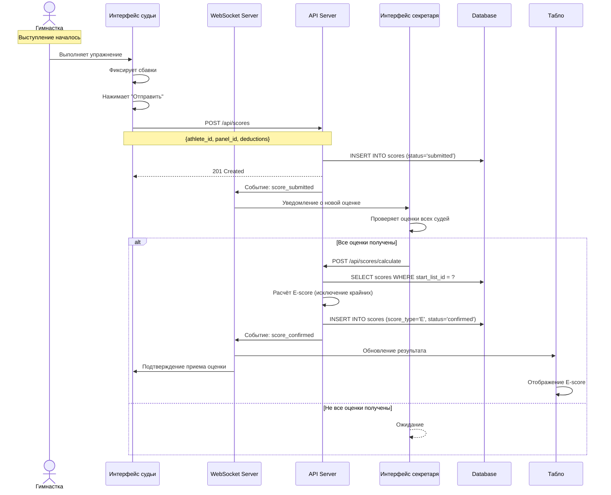
```mermaid
sequenceDiagram
    actor Athlete as Гимнастка
    participant Judge as Интерфейс судьи
    participant WS as WebSocket Server
    participant API as API Server
    participant Secretary as Интерфейс секретаря
    participant DB as Database
    participant Screen as Табло

    Note over Athlete: Выступление началось

    Athlete->>Judge: Выполняет упражнение

    Judge->>Judge: Фиксирует сбавки
    Judge->>Judge: Нажимает "Отправить"

    Judge->>API: POST /api/scores
    Note over Judge,API: {athlete_id, panel_id, deductions}

    API->>DB: INSERT INTO scores (status='submitted')
    API-->>Judge: 201 Created

    API->>WS: Событие: score_submitted
    WS->>Secretary: Уведомление о новой оценке

    Secretary->>Secretary: Проверяет оценки всех судей
    alt Все оценки получены
        Secretary->>API: POST /api/scores/calculate
        API->>DB: SELECT scores WHERE start_list_id = ?
        API->>API: Расчёт E-score (исключение крайних)
        API->>DB: INSERT INTO scores (score_type='E', status='confirmed')

        API->>WS: Событие: score_confirmed
        WS->>Screen: Обновление результата
        WS->>Judge: Подтверждение приема оценки

        Screen->>Screen: Отображение E-score
    else Не все оценки получены
        Secretary-->>Secretary: Ожидание
    end
```

---

### 3. Синхронизация локальной сети с облаком

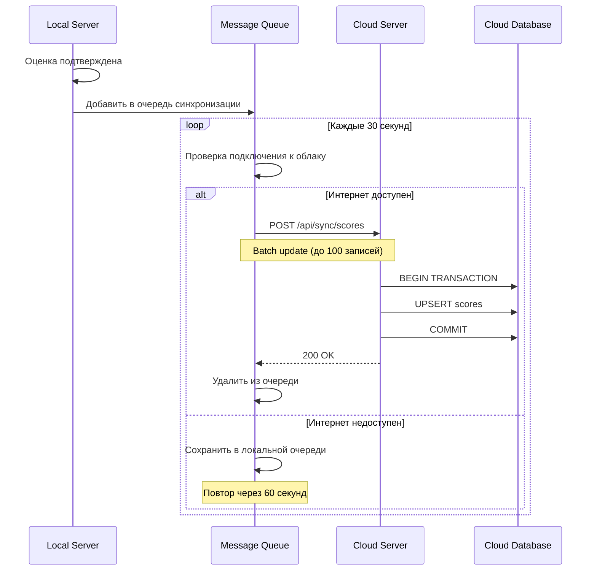
```mermaid
sequenceDiagram
    participant Local as Local Server
    participant Queue as Message Queue
    participant Cloud as Cloud Server
    participant CloudDB as Cloud Database

    Local->>Local: Оценка подтверждена
    Local->>Queue: Добавить в очередь синхронизации

    loop Каждые 30 секунд
        Queue->>Queue: Проверка подключения к облаку
        alt Интернет доступен
            Queue->>Cloud: POST /api/sync/scores
            Note over Queue,Cloud: Batch update (до 100 записей)

            Cloud->>CloudDB: BEGIN TRANSACTION
            Cloud->>CloudDB: UPSERT scores
            Cloud->>CloudDB: COMMIT

            Cloud-->>Queue: 200 OK
            Queue->>Queue: Удалить из очереди
        else Интернет недоступен
            Queue->>Queue: Сохранить в локальной очереди
            Note over Queue: Повтор через 60 секунд
        end
    end
```

---

### 4. Регистрация спортсменки на соревнование

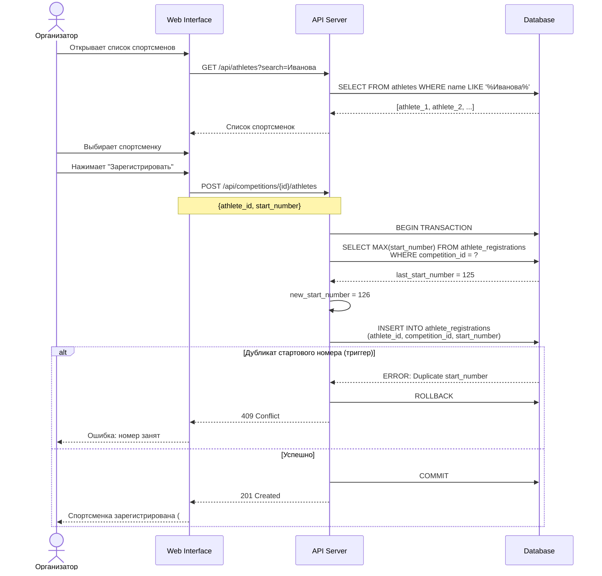
```mermaid
sequenceDiagram
    actor Organizer as Организатор
    participant UI as Web Interface
    participant API as API Server
    participant DB as Database

    Organizer->>UI: Открывает список спортсменов
    UI->>API: GET /api/athletes?search=Иванова
    API->>DB: SELECT FROM athletes WHERE name LIKE '%Иванова%'
    DB-->>API: [athlete_1, athlete_2, ...]
    API-->>UI: Список спортсменок

    Organizer->>UI: Выбирает спортсменку
    Organizer->>UI: Нажимает "Зарегистрировать"

    UI->>API: POST /api/competitions/{id}/athletes
    Note over UI,API: {athlete_id, start_number}

    API->>DB: BEGIN TRANSACTION

    API->>DB: SELECT MAX(start_number) FROM athlete_registrations<br/>WHERE competition_id = ?
    DB-->>API: last_start_number = 125

    API->>API: new_start_number = 126

    API->>DB: INSERT INTO athlete_registrations<br/>(athlete_id, competition_id, start_number)

    alt Дубликат стартового номера (триггер)
        DB-->>API: ERROR: Duplicate start_number
        API->>DB: ROLLBACK
        API-->>UI: 409 Conflict
        UI-->>Organizer: Ошибка: номер занят
    else Успешно
        API->>DB: COMMIT
        API-->>UI: 201 Created
        UI-->>Organizer: Спортсменка зарегистрирована (#126)
    end
```

---

## Диаграммы состояний

### 1. Состояния выступления (Routine States)

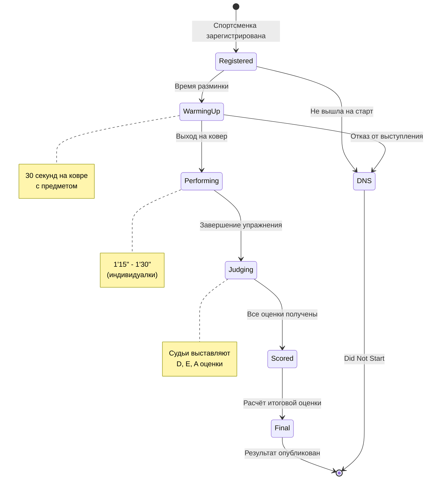
```mermaid
stateDiagram-v2
    [*] --> Registered: Спортсменка зарегистрирована

    Registered --> WarmingUp: Время разминки
    WarmingUp --> Performing: Выход на ковер
    Performing --> Judging: Завершение упражнения
    Judging --> Scored: Все оценки получены
    Scored --> Final: Расчёт итоговой оценки

    Final --> [*]: Результат опубликован

    Registered --> DNS: Не вышла на старт
    WarmingUp --> DNS: Отказ от выступления
    DNS --> [*]: Did Not Start

    note right of WarmingUp
        30 секунд на ковре
        с предметом
    end note

    note right of Performing
        1'15" - 1'30"
        (индивидуалки)
    end note

    note right of Judging
        Судьи выставляют
        D, E, A оценки
    end note
```

---

### 2. Состояния оценки (Score States)

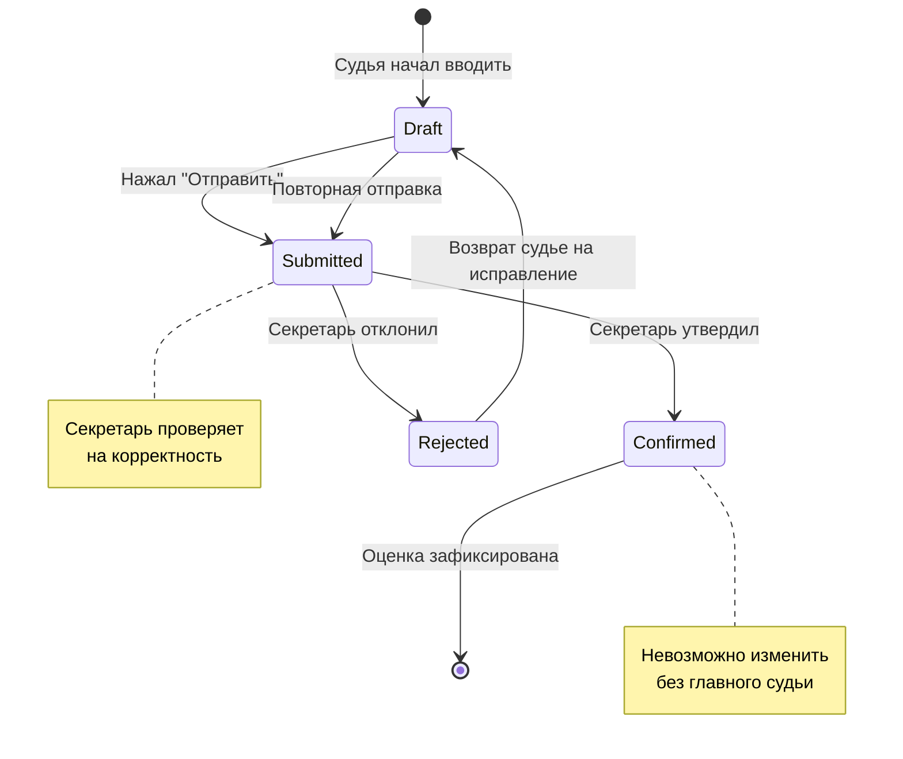
```mermaid
stateDiagram-v2
    [*] --> Draft: Судья начал вводить

    Draft --> Submitted: Нажал "Отправить"
    Submitted --> Confirmed: Секретарь утвердил
    Submitted --> Rejected: Секретарь отклонил

    Rejected --> Draft: Возврат судье на исправление
    Draft --> Submitted: Повторная отправка

    Confirmed --> [*]: Оценка зафиксирована

    note right of Submitted
        Секретарь проверяет
        на корректность
    end note

    note right of Confirmed
        Невозможно изменить
        без главного судьи
    end note
```

---

### 3. Состояния соревнования

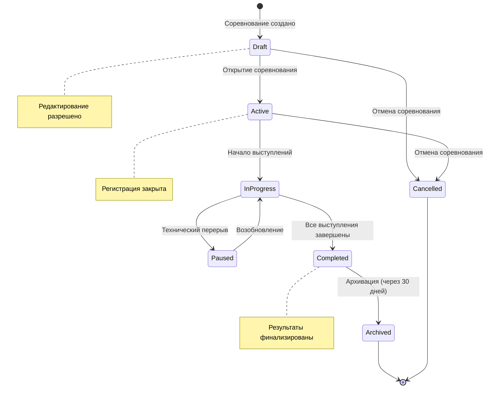
```mermaid
stateDiagram-v2
    [*] --> Draft: Соревнование создано

    Draft --> Active: Открытие соревнования
    Active --> InProgress: Начало выступлений
    InProgress --> Paused: Технический перерыв
    Paused --> InProgress: Возобновление
    InProgress --> Completed: Все выступления завершены
    Completed --> Archived: Архивация (через 30 дней)

    Archived --> [*]

    Draft --> Cancelled: Отмена соревнования
    Active --> Cancelled: Отмена соревнования
    Cancelled --> [*]

    note right of Draft
        Редактирование разрешено
    end note

    note right of Active
        Регистрация закрыта
    end note

    note right of Completed
        Результаты финализированы
    end note
```

---

### 4. Состояния судейской бригады

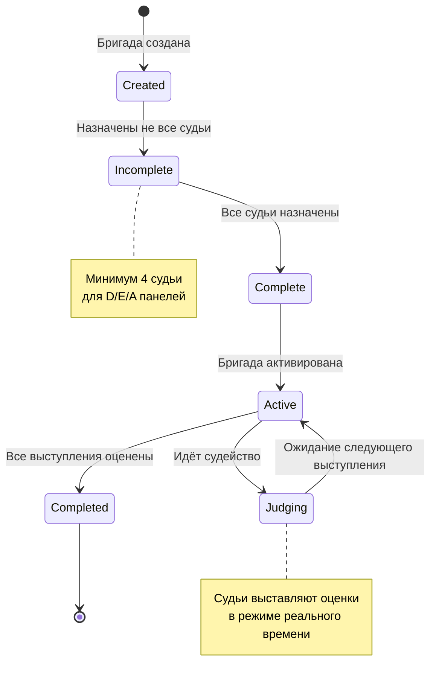
```mermaid
stateDiagram-v2
    [*] --> Created: Бригада создана

    Created --> Incomplete: Назначены не все судьи
    Incomplete --> Complete: Все судьи назначены
    Complete --> Active: Бригада активирована

    Active --> Judging: Идёт судейство
    Judging --> Active: Ожидание следующего выступления

    Active --> Completed: Все выступления оценены
    Completed --> [*]

    note right of Incomplete
        Минимум 4 судьи
        для D/E/A панелей
    end note

    note right of Judging
        Судьи выставляют оценки
        в режиме реального времени
    end note
```

---

## Диаграммы компонентов

### 1. Компоненты системы судейства

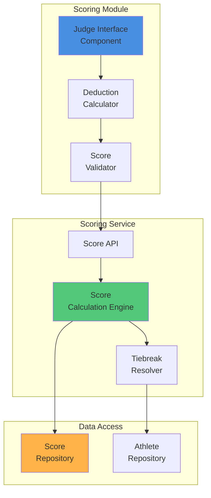
```mermaid
graph TB
    subgraph "Scoring Module"
        JUDGE_UI[Judge Interface<br/>Component]
        DEDUCTION[Deduction<br/>Calculator]
        VALIDATOR[Score<br/>Validator]
    end

    subgraph "Scoring Service"
        SCORE_API[Score API]
        CALC[Score<br/>Calculation Engine]
        TIEBREAK[Tiebreak<br/>Resolver]
    end

    subgraph "Data Access"
        SCORE_REPO[Score<br/>Repository]
        ATHLETE_REPO[Athlete<br/>Repository]
    end

    JUDGE_UI --> DEDUCTION
    DEDUCTION --> VALIDATOR
    VALIDATOR --> SCORE_API

    SCORE_API --> CALC
    CALC --> SCORE_REPO
    CALC --> TIEBREAK

    TIEBREAK --> ATHLETE_REPO

    style JUDGE_UI fill:#4A90E2
    style CALC fill:#50C878
    style SCORE_REPO fill:#FFB347
```

---

### 2. Компоненты WebSocket сервера

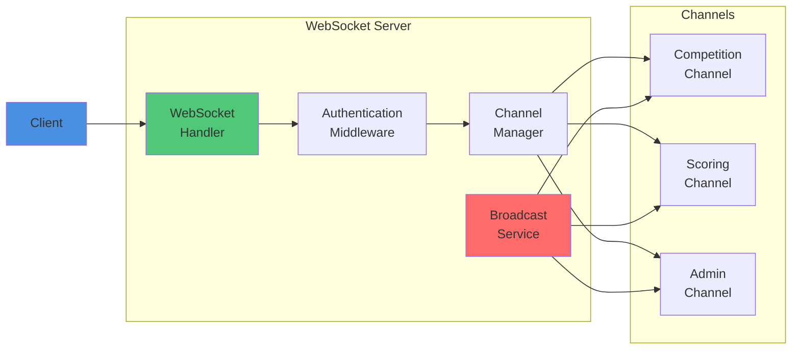
```mermaid
graph LR
    subgraph "WebSocket Server"
        WS_HANDLER[WebSocket<br/>Handler]
        AUTH_MIDDLEWARE[Authentication<br/>Middleware]
        CHANNEL_MGR[Channel<br/>Manager]
        BROADCAST[Broadcast<br/>Service]
    end

    subgraph "Channels"
        COMP_CH[Competition<br/>Channel]
        SCORE_CH[Scoring<br/>Channel]
        ADMIN_CH[Admin<br/>Channel]
    end

    CLIENT[Client] --> WS_HANDLER
    WS_HANDLER --> AUTH_MIDDLEWARE
    AUTH_MIDDLEWARE --> CHANNEL_MGR

    CHANNEL_MGR --> COMP_CH
    CHANNEL_MGR --> SCORE_CH
    CHANNEL_MGR --> ADMIN_CH

    BROADCAST --> COMP_CH
    BROADCAST --> SCORE_CH
    BROADCAST --> ADMIN_CH

    style CLIENT fill:#4A90E2
    style WS_HANDLER fill:#50C878
    style BROADCAST fill:#FF6B6B
```

---

## Диаграммы развертывания

### 1. Развертывание в облаке

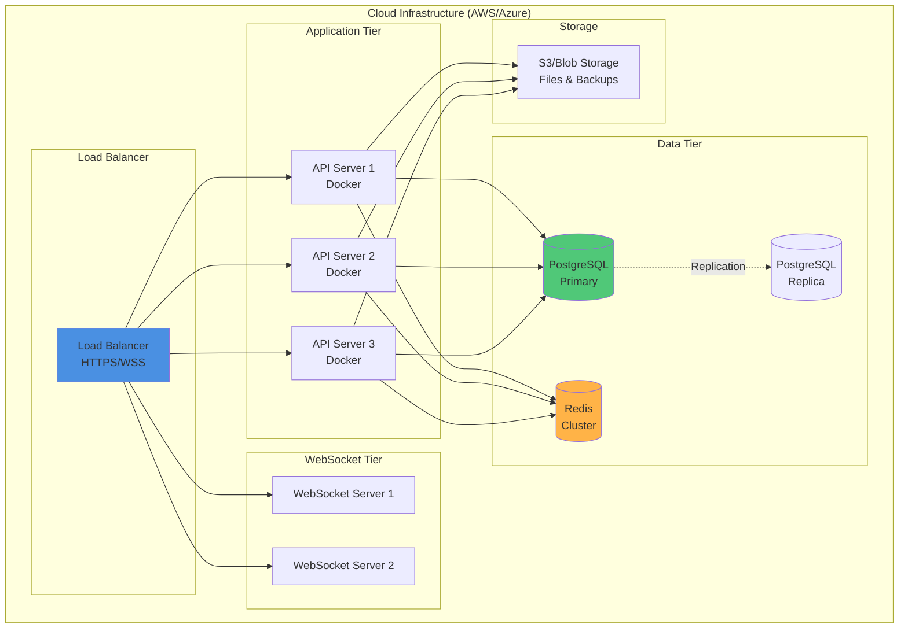
```mermaid
graph TB
    subgraph "Cloud Infrastructure (AWS/Azure)"
        subgraph "Load Balancer"
            LB[Load Balancer<br/>HTTPS/WSS]
        end

        subgraph "Application Tier"
            APP1[API Server 1<br/>Docker]
            APP2[API Server 2<br/>Docker]
            APP3[API Server 3<br/>Docker]
        end

        subgraph "WebSocket Tier"
            WS1[WebSocket Server 1]
            WS2[WebSocket Server 2]
        end

        subgraph "Data Tier"
            DB_PRIMARY[(PostgreSQL<br/>Primary)]
            DB_REPLICA[(PostgreSQL<br/>Replica)]
            REDIS[(Redis<br/>Cluster)]
        end

        subgraph "Storage"
            S3[S3/Blob Storage<br/>Files & Backups]
        end
    end

    LB --> APP1
    LB --> APP2
    LB --> APP3

    LB --> WS1
    LB --> WS2

    APP1 --> DB_PRIMARY
    APP2 --> DB_PRIMARY
    APP3 --> DB_PRIMARY

    DB_PRIMARY -.Replication.-> DB_REPLICA

    APP1 --> REDIS
    APP2 --> REDIS
    APP3 --> REDIS

    APP1 --> S3
    APP2 --> S3
    APP3 --> S3

    style LB fill:#4A90E2
    style DB_PRIMARY fill:#50C878
    style REDIS fill:#FFB347
```

---

### 2. Локальное развертывание (на соревновании)

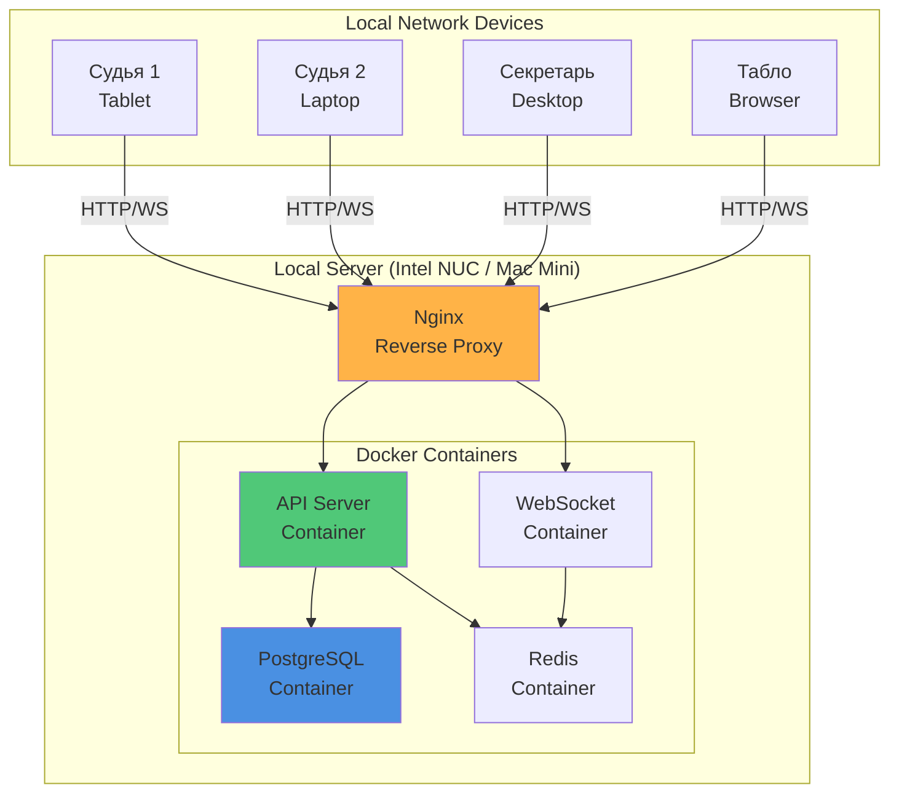
```mermaid
graph TB
    subgraph "Local Server (Intel NUC / Mac Mini)"
        subgraph "Docker Containers"
            API[API Server<br/>Container]
            WS[WebSocket<br/>Container]
            DB[PostgreSQL<br/>Container]
            REDIS[Redis<br/>Container]
        end

        NGINX[Nginx<br/>Reverse Proxy]
    end

    subgraph "Local Network Devices"
        JUDGE1[Судья 1<br/>Tablet]
        JUDGE2[Судья 2<br/>Laptop]
        SEC[Секретарь<br/>Desktop]
        SCREEN[Табло<br/>Browser]
    end

    JUDGE1 -->|HTTP/WS| NGINX
    JUDGE2 -->|HTTP/WS| NGINX
    SEC -->|HTTP/WS| NGINX
    SCREEN -->|HTTP/WS| NGINX

    NGINX --> API
    NGINX --> WS

    API --> DB
    API --> REDIS
    WS --> REDIS

    style API fill:#50C878
    style DB fill:#4A90E2
    style NGINX fill:#FFB347
```

---

### 3. Гибридное развертывание (локальная сеть + облако)

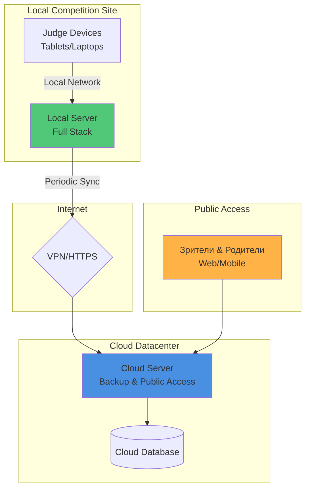
```mermaid
graph TB
    subgraph "Local Competition Site"
        LOCAL[Local Server<br/>Full Stack]
        DEVICES[Judge Devices<br/>Tablets/Laptops]

        DEVICES -->|Local Network| LOCAL
    end

    subgraph "Internet"
        VPN{VPN/HTTPS}
    end

    subgraph "Cloud Datacenter"
        CLOUD[Cloud Server<br/>Backup & Public Access]
        CLOUD_DB[(Cloud Database)]

        CLOUD --> CLOUD_DB
    end

    LOCAL -->|Periodic Sync| VPN
    VPN --> CLOUD

    subgraph "Public Access"
        PUBLIC[Зрители & Родители<br/>Web/Mobile]
        PUBLIC --> CLOUD
    end

    style LOCAL fill:#50C878
    style CLOUD fill:#4A90E2
    style PUBLIC fill:#FFB347
```

---

## Диаграммы бизнес-процессов

### 1. Полный цикл соревнования

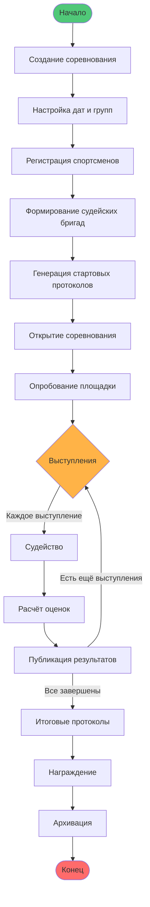
```mermaid
graph TD
    START([Начало]) --> CREATE[Создание соревнования]
    CREATE --> SETUP[Настройка дат и групп]
    SETUP --> REG[Регистрация спортсменов]
    REG --> JUDGES[Формирование судейских бригад]
    JUDGES --> STARTLIST[Генерация стартовых протоколов]

    STARTLIST --> COMP_START[Открытие соревнования]
    COMP_START --> PODIUM[Опробование площадки]

    PODIUM --> PERFORM{Выступления}
    PERFORM -->|Каждое выступление| JUDGE[Судейство]
    JUDGE --> CALC[Расчёт оценок]
    CALC --> RESULTS[Публикация результатов]

    RESULTS -->|Есть ещё выступления| PERFORM
    RESULTS -->|Все завершены| FINAL[Итоговые протоколы]

    FINAL --> CEREMONY[Награждение]
    CEREMONY --> ARCHIVE[Архивация]
    ARCHIVE --> END([Конец])

    style START fill:#50C878
    style END fill:#FF6B6B
    style PERFORM fill:#FFB347
```

---

## Диаграмма потоков данных (Data Flow)

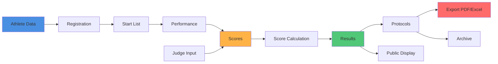
```mermaid
graph LR
    ATHLETE[Athlete Data] --> REG[Registration]
    REG --> START_LIST[Start List]

    START_LIST --> PERFORMANCE[Performance]
    PERFORMANCE --> SCORES[Scores]

    JUDGES[Judge Input] --> SCORES
    SCORES --> CALC[Score Calculation]

    CALC --> RESULTS[Results]
    RESULTS --> PROTOCOLS[Protocols]
    RESULTS --> DISPLAY[Public Display]

    PROTOCOLS --> EXPORT[Export PDF/Excel]
    PROTOCOLS --> ARCHIVE[Archive]

    style ATHLETE fill:#4A90E2
    style SCORES fill:#FFB347
    style RESULTS fill:#50C878
    style EXPORT fill:#FF6B6B
```

---

**Конец документа**

> **Примечание:** Все диаграммы созданы в формате Mermaid и могут быть отображены в GitHub, GitLab, Obsidian и других платформах, поддерживающих Mermaid.
