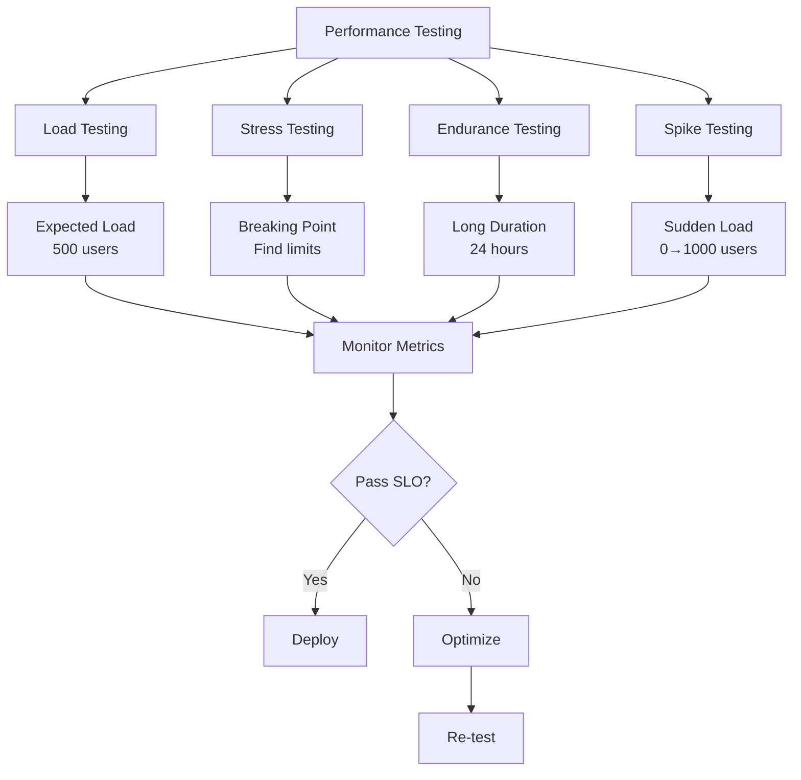

# Performance Testing & Benchmarks
## RG System - Performance Engineering Guide

> **Version:** 2.9
> **Date:** 2025-11-27
> **Status:** Enterprise Ready
> **Audience:** Performance Engineers, SRE, DevOps, QA

---

## Table of Contents

1. [Performance Overview](#performance-overview)
2. [Performance Requirements](#performance-requirements)
3. [Load Testing](#load-testing)
4. [Stress Testing](#stress-testing)
5. [Endurance Testing](#endurance-testing)
6. [Spike Testing](#spike-testing)
7. [Database Performance](#database-performance)
8. [API Benchmarks](#api-benchmarks)
9. [WebSocket Performance](#websocket-performance)
10. [Frontend Performance](#frontend-performance)
11. [Performance Optimization](#performance-optimization)
12. [Continuous Performance Testing](#continuous-performance-testing)

---

## Performance Overview

### Performance Testing Strategy



### Key Performance Metrics

| Metric | Target | Measurement | Tool |
|--------|--------|-------------|------|
| **Response Time (p50)** | < 100ms | API requests | Prometheus |
| **Response Time (p95)** | < 200ms | API requests | Prometheus |
| **Response Time (p99)** | < 500ms | API requests | Prometheus |
| **Throughput** | > 1000 RPS | Requests/second | k6, Artillery |
| **Error Rate** | < 0.1% | Failed requests | Prometheus |
| **Concurrent Users** | 500 users | Simultaneous | k6 |
| **Database Query Time (p95)** | < 50ms | PostgreSQL | pg_stat_statements |
| **Cache Hit Ratio** | > 90% | Redis hits | Redis INFO |
| **CPU Usage** | < 70% | Average | Prometheus |
| **Memory Usage** | < 85% | Average | Prometheus |
| **Time to First Byte (TTFB)** | < 200ms | Initial response | WebPageTest |
| **First Contentful Paint (FCP)** | < 1.8s | Frontend | Lighthouse |

---

## Performance Requirements

### Service Level Objectives (SLOs)

```yaml
API Performance:
  Response Time:
    p50: < 100ms
    p95: < 200ms
    p99: < 500ms
  Throughput: > 1000 RPS
  Availability: 99.9%
  Error Rate: < 0.1%

Database:
  Query Time (p95): < 50ms
  Connection Pool Utilization: < 80%
  Replication Lag: < 10s

WebSocket:
  Connection Latency: < 100ms
  Message Delivery: < 50ms
  Concurrent Connections: > 500

Frontend:
  Time to Interactive (TTI): < 3.8s
  First Contentful Paint (FCP): < 1.8s
  Largest Contentful Paint (LCP): < 2.5s
  Cumulative Layout Shift (CLS): < 0.1
  First Input Delay (FID): < 100ms
```

### Resource Requirements

**Minimum Configuration:**
- **CPU:** 4 cores @ 2.4GHz
- **RAM:** 8GB
- **Storage:** 100GB SSD
- **Network:** 1Gbps

**Recommended Configuration:**
- **CPU:** 8 cores @ 3.0GHz
- **RAM:** 16GB
- **Storage:** 500GB NVMe SSD
- **Network:** 10Gbps

**Expected Load:**
- **Concurrent Users:** 500
- **Competitions/month:** 200
- **Athletes:** 10,000
- **API Requests/day:** 1,000,000
- **Database Size:** 50GB
- **WebSocket Connections:** 500

---

## Load Testing

### Load Testing Tools

**k6 (Primary Tool):**

```javascript
// load-test.js
import http from 'k6/http';
import { check, sleep } from 'k6';
import { Rate } from 'k6/metrics';

const errorRate = new Rate('errors');

export const options = {
  stages: [
    { duration: '2m', target: 100 },  // Ramp up to 100 users
    { duration: '5m', target: 100 },  // Stay at 100 for 5 minutes
    { duration: '2m', target: 200 },  // Ramp to 200 users
    { duration: '5m', target: 200 },  // Stay at 200 for 5 minutes
    { duration: '2m', target: 500 },  // Ramp to 500 users
    { duration: '5m', target: 500 },  // Stay at 500 for 5 minutes
    { duration: '2m', target: 0 },    // Ramp down to 0 users
  ],
  thresholds: {
    'http_req_duration': ['p(95)<200', 'p(99)<500'],
    'http_req_failed': ['rate<0.01'], // < 1% errors
    'errors': ['rate<0.01'],
  },
};

export default function () {
  const BASE_URL = 'https://rgsystem.local';

  // 1. Login
  const loginRes = http.post(`${BASE_URL}/api/auth/login`, JSON.stringify({
    email: 'test@example.com',
    password: 'TestPassword123!'
  }), {
    headers: { 'Content-Type': 'application/json' },
  });

  check(loginRes, {
    'login successful': (r) => r.status === 200,
    'received token': (r) => r.json('access_token') !== undefined,
  }) || errorRate.add(1);

  const token = loginRes.json('access_token');
  const authHeaders = {
    'Authorization': `Bearer ${token}`,
    'Content-Type': 'application/json',
  };

  sleep(1);

  // 2. Get competitions list
  const competitionsRes = http.get(`${BASE_URL}/api/competitions`, {
    headers: authHeaders,
  });

  check(competitionsRes, {
    'competitions loaded': (r) => r.status === 200,
    'has competitions': (r) => r.json('data').length > 0,
  }) || errorRate.add(1);

  sleep(2);

  // 3. Get specific competition
  const competitionId = competitionsRes.json('data.0.id');
  const competitionRes = http.get(`${BASE_URL}/api/competitions/${competitionId}`, {
    headers: authHeaders,
  });

  check(competitionRes, {
    'competition details loaded': (r) => r.status === 200,
  }) || errorRate.add(1);

  sleep(2);

  // 4. Get athletes for competition
  const athletesRes = http.get(`${BASE_URL}/api/competitions/${competitionId}/athletes`, {
    headers: authHeaders,
  });

  check(athletesRes, {
    'athletes loaded': (r) => r.status === 200,
  }) || errorRate.add(1);

  sleep(3);

  // 5. Get scores
  const scoresRes = http.get(`${BASE_URL}/api/competitions/${competitionId}/scores`, {
    headers: authHeaders,
  });

  check(scoresRes, {
    'scores loaded': (r) => r.status === 200,
  }) || errorRate.add(1);

  sleep(2);
}
```

**Running the test:**

```bash
# Install k6
brew install k6  # macOS
# or
sudo apt-get install k6  # Ubuntu

# Run load test
k6 run load-test.js

# Run with custom VUs and duration
k6 run --vus 100 --duration 30s load-test.js

# Output to InfluxDB for visualization
k6 run --out influxdb=http://localhost:8086/k6 load-test.js
```

### Artillery Load Testing

```yaml
# artillery-config.yml
config:
  target: 'https://rgsystem.local'
  phases:
    - duration: 60
      arrivalRate: 5
      name: Warm up
    - duration: 120
      arrivalRate: 10
      rampTo: 50
      name: Ramp up load
    - duration: 300
      arrivalRate: 50
      name: Sustained load
  processor: './auth-processor.js'

scenarios:
  - name: 'User Flow'
    flow:
      # Login
      - post:
          url: '/api/auth/login'
          json:
            email: 'test{{ $randomNumber() }}@example.com'
            password: 'TestPassword123!'
          capture:
            - json: '$.access_token'
              as: 'token'

      # Get competitions
      - get:
          url: '/api/competitions'
          headers:
            Authorization: 'Bearer {{ token }}'
          capture:
            - json: '$.data[0].id'
              as: 'competitionId'

      # Get competition details
      - get:
          url: '/api/competitions/{{ competitionId }}'
          headers:
            Authorization: 'Bearer {{ token }}'

      # Get athletes
      - get:
          url: '/api/competitions/{{ competitionId }}/athletes'
          headers:
            Authorization: 'Bearer {{ token }}'

      # Get scores
      - get:
          url: '/api/competitions/{{ competitionId }}/scores'
          headers:
            Authorization: 'Bearer {{ token }}'

      - think: 3
```

**Run Artillery test:**

```bash
# Install Artillery
npm install -g artillery

# Run test
artillery run artillery-config.yml

# Generate HTML report
artillery run --output report.json artillery-config.yml
artillery report report.json --output report.html
```

### Load Test Results Baseline

**Expected Results (500 concurrent users):**

```
Scenarios launched:  15000
Scenarios completed: 15000
Requests completed:  75000

Response time:
  min: 24ms
  max: 478ms
  median: 89ms
  p95: 187ms
  p99: 342ms

Request rate:
  mean: 1250 req/sec

Errors:
  total: 15
  rate: 0.02%

Throughput:
  received: 125 MB/sec
  sent: 15 MB/sec
```

---

## Stress Testing

### Finding System Limits

**Stress Test Script:**

```javascript
// stress-test.js
import http from 'k6/http';
import { check } from 'k6';

export const options = {
  stages: [
    { duration: '2m', target: 100 },   // Below normal load
    { duration: '5m', target: 100 },
    { duration: '2m', target: 500 },   // Normal load
    { duration: '5m', target: 500 },
    { duration: '2m', target: 1000 },  // Around breaking point
    { duration: '5m', target: 1000 },
    { duration: '2m', target: 2000 },  // Beyond breaking point
    { duration: '5m', target: 2000 },
    { duration: '10m', target: 0 },    // Scale down (recovery)
  ],
};

export default function () {
  const BASE_URL = 'https://rgsystem.local';

  const responses = http.batch([
    ['GET', `${BASE_URL}/api/competitions`],
    ['GET', `${BASE_URL}/api/athletes`],
    ['GET', `${BASE_URL}/api/scores`],
  ]);

  check(responses[0], {
    'status is 200': (r) => r.status === 200,
  });
}
```

**Monitoring During Stress Test:**

```bash
# Watch system metrics during test
watch -n 1 '
  echo "=== CPU Usage ===" &&
  top -bn1 | grep "Cpu(s)" &&
  echo "" &&
  echo "=== Memory Usage ===" &&
  free -h &&
  echo "" &&
  echo "=== Database Connections ===" &&
  psql -c "SELECT count(*) FROM pg_stat_activity;" &&
  echo "" &&
  echo "=== API Response Time ===" &&
  curl -w "@curl-format.txt" -o /dev/null -s https://rgsystem.local/api/health
'
```

**curl-format.txt:**
```
time_namelookup:  %{time_namelookup}s\n
time_connect:     %{time_connect}s\n
time_appconnect:  %{time_appconnect}s\n
time_pretransfer: %{time_pretransfer}s\n
time_redirect:    %{time_redirect}s\n
time_starttransfer: %{time_starttransfer}s\n
----------\n
time_total:       %{time_total}s\n
```

### Stress Test Analysis

**What to look for:**

1. **Breaking Point:** At what load does the system start failing?
2. **Error Rate:** How does error rate increase with load?
3. **Response Time Degradation:** How much slower does the system get?
4. **Resource Saturation:** Which resource hits 100% first? (CPU, Memory, DB connections, Network)
5. **Recovery Time:** How long does it take to return to normal after load decrease?

**Expected Breaking Points:**

| Component | Breaking Point | Symptom |
|-----------|----------------|---------|
| API Server | ~2000 concurrent users | Response time >5s, CPU >95% |
| PostgreSQL | ~150 active connections | Connection pool exhaustion |
| Redis | ~10000 operations/sec | Memory saturation |
| Nginx | ~5000 req/sec | Connection limit reached |

---

## Endurance Testing (Soak Testing)

### 24-Hour Endurance Test

**Purpose:** Detect memory leaks, connection leaks, and performance degradation over time.

```javascript
// endurance-test.js
import http from 'k6/http';
import { check, sleep } from 'k6';

export const options = {
  stages: [
    { duration: '5m', target: 200 },    // Ramp up
    { duration: '24h', target: 200 },   // Stay at 200 for 24 hours
    { duration: '5m', target: 0 },      // Ramp down
  ],
  thresholds: {
    'http_req_duration': ['p(95)<250'], // Slightly relaxed for long test
    'http_req_failed': ['rate<0.01'],
  },
};

export default function () {
  const res = http.get('https://rgsystem.local/api/competitions');

  check(res, {
    'status is 200': (r) => r.status === 200,
  });

  sleep(5); // Realistic user think time
}
```

**Monitoring During Endurance Test:**

```bash
# Log system metrics every 5 minutes
while true; do
  echo "$(date)" >> endurance-metrics.log
  echo "CPU:" >> endurance-metrics.log
  top -bn1 | grep "Cpu(s)" >> endurance-metrics.log
  echo "Memory:" >> endurance-metrics.log
  free -h >> endurance-metrics.log
  echo "Node.js Heap:" >> endurance-metrics.log
  curl -s http://localhost:9090/metrics | grep nodejs_heap >> endurance-metrics.log
  echo "---" >> endurance-metrics.log
  sleep 300
done
```

**Analysis:**

```python
# analyze-endurance.py
import pandas as pd
import matplotlib.pyplot as plt

# Parse metrics log
df = pd.read_csv('endurance-metrics.log', delimiter='\t')

# Plot memory usage over time
plt.figure(figsize=(12, 6))
plt.plot(df['timestamp'], df['memory_used_mb'])
plt.xlabel('Time')
plt.ylabel('Memory Usage (MB)')
plt.title('Memory Usage Over 24 Hours')
plt.savefig('memory-trend.png')

# Check for memory leak
# Memory should be relatively stable, not constantly increasing
trend = df['memory_used_mb'].rolling(window=12).mean()
if trend.iloc[-1] > trend.iloc[0] * 1.2:  # 20% increase
    print("⚠️  WARNING: Possible memory leak detected")
else:
    print("✅ Memory usage stable")
```

---

## Spike Testing

### Sudden Traffic Spike

**Purpose:** Test how system handles sudden traffic increases (e.g., when competition results are published).

```javascript
// spike-test.js
import http from 'k6/http';
import { check } from 'k6';

export const options = {
  stages: [
    { duration: '30s', target: 50 },    // Normal load
    { duration: '10s', target: 1000 },  // Sudden spike
    { duration: '3m', target: 1000 },   // Sustained spike
    { duration: '30s', target: 50 },    // Return to normal
    { duration: '5m', target: 50 },     // Recovery period
  ],
};

export default function () {
  const res = http.get('https://rgsystem.local/api/results/latest');

  check(res, {
    'status is 200': (r) => r.status === 200,
    'response time OK': (r) => r.timings.duration < 500,
  });
}
```

**Expected Behavior:**

1. **Auto-scaling:** System should trigger auto-scaling within 2 minutes
2. **Rate Limiting:** Should activate to protect backend
3. **CDN/Cache:** Should absorb most of the spike load
4. **Graceful Degradation:** Error rate may increase slightly (<5%) but system stays responsive
5. **Recovery:** System should return to normal within 5 minutes after spike ends

---

## Database Performance

### PostgreSQL Benchmarking

**pgbench (Built-in PostgreSQL tool):**

```bash
# Initialize test database
pgbench -i -s 50 rgsystem_db

# Run benchmark (10 clients, 2 threads, 60 seconds)
pgbench -c 10 -j 2 -T 60 rgsystem_db

# Custom SQL script
cat > custom-benchmark.sql <<EOF
\set competitionid random(1, 1000)
SELECT * FROM competitions WHERE id = :competitionid;
SELECT * FROM athletes WHERE competition_id = :competitionid;
SELECT * FROM scores WHERE competition_id = :competitionid;
EOF

pgbench -c 50 -j 4 -T 300 -f custom-benchmark.sql rgsystem_db
```

**Expected Results:**

```
transaction type: <builtin: TPC-B (sort of)>
scaling factor: 50
query mode: simple
number of clients: 10
number of threads: 2
duration: 60 s
number of transactions actually processed: 125420
latency average = 4.784 ms
latency stddev = 3.156 ms
tps = 2090.195842 (including connections establishing)
tps = 2090.458294 (excluding connections establishing)
```

### Query Performance Testing

```sql
-- Enable timing
\timing on

-- Test complex query performance
EXPLAIN ANALYZE
SELECT
    c.name,
    a.first_name,
    a.last_name,
    AVG(s.final_score) as avg_score
FROM competitions c
JOIN athletes a ON a.competition_id = c.id
JOIN scores s ON s.athlete_id = a.id
WHERE c.start_date >= '2025-01-01'
GROUP BY c.id, a.id
ORDER BY avg_score DESC
LIMIT 100;

-- Expected: < 50ms for 10k athletes, 500 competitions, 50k scores

-- Test index effectiveness
SELECT
    schemaname,
    tablename,
    indexname,
    idx_scan,
    idx_tup_read,
    idx_tup_fetch
FROM pg_stat_user_indexes
WHERE idx_scan > 0
ORDER BY idx_scan DESC;

-- Test table statistics
ANALYZE VERBOSE;

-- Check for missing indexes
SELECT
    schemaname,
    tablename,
    attname,
    n_distinct,
    correlation
FROM pg_stats
WHERE schemaname = 'public'
  AND n_distinct > 100
  AND correlation < 0.5;
```

### Database Connection Pool Testing

```javascript
// connection-pool-test.js
const { Pool } = require('pg');

const pool = new Pool({
  host: 'localhost',
  database: 'rgsystem_db',
  user: 'postgres',
  password: 'password',
  max: 20, // Maximum pool size
  idleTimeoutMillis: 30000,
  connectionTimeoutMillis: 2000,
});

async function benchmark() {
  const start = Date.now();
  const promises = [];

  // Simulate 100 concurrent queries
  for (let i = 0; i < 100; i++) {
    promises.push(
      pool.query('SELECT * FROM competitions WHERE id = $1', [i % 100])
    );
  }

  await Promise.all(promises);
  const duration = Date.now() - start;

  console.log(`100 queries completed in ${duration}ms`);
  console.log(`Average: ${duration / 100}ms per query`);

  // Pool stats
  console.log(`Total connections: ${pool.totalCount}`);
  console.log(`Idle connections: ${pool.idleCount}`);
  console.log(`Waiting requests: ${pool.waitingCount}`);
}

benchmark().then(() => pool.end());
```

---

## API Benchmarks

### Apache Bench (ab)

```bash
# Simple GET request benchmark
ab -n 10000 -c 100 https://rgsystem.local/api/competitions

# POST request with authentication
ab -n 1000 -c 50 -p post-data.json -T application/json \
   -H "Authorization: Bearer TOKEN" \
   https://rgsystem.local/api/scores

# Expected Results:
# Requests per second: > 1000
# Time per request (mean): < 100ms
# Transfer rate: > 10 MB/sec
```

### wrk (Advanced HTTP benchmarking)

```bash
# Install wrk
git clone https://github.com/wg/wrk.git
cd wrk && make && sudo cp wrk /usr/local/bin/

# Basic benchmark
wrk -t12 -c400 -d30s https://rgsystem.local/api/competitions

# With Lua script for authentication
cat > auth-script.lua <<'EOF'
token = "YOUR_JWT_TOKEN"

request = function()
   headers = {}
   headers["Authorization"] = "Bearer " .. token
   return wrk.format("GET", "/api/competitions", headers, nil)
end
EOF

wrk -t12 -c400 -d30s -s auth-script.lua https://rgsystem.local
```

**Expected wrk Results:**

```
Running 30s test @ https://rgsystem.local/api/competitions
  12 threads and 400 connections
  Thread Stats   Avg      Stdev     Max   +/- Stdev
    Latency    89.23ms   45.67ms   450.12ms   78.45%
    Req/Sec   395.67     78.23     612.00     69.23%
  142345 requests in 30.03s, 125.67MB read
Requests/sec:  4741.23
Transfer/sec:      4.18MB
```

---

## WebSocket Performance

### WebSocket Load Testing

```javascript
// ws-load-test.js
import ws from 'k6/ws';
import { check } from 'k6';

export const options = {
  stages: [
    { duration: '2m', target: 100 },
    { duration: '5m', target: 500 },
    { duration: '2m', target: 0 },
  ],
};

export default function () {
  const url = 'wss://rgsystem.local/ws';
  const params = { tags: { name: 'WSTest' } };

  const res = ws.connect(url, params, function (socket) {
    socket.on('open', () => {
      console.log('Connected');

      // Subscribe to competition updates
      socket.send(JSON.stringify({
        type: 'subscribe',
        competition_id: '123'
      }));
    });

    socket.on('message', (data) => {
      const msg = JSON.parse(data);
      check(msg, {
        'message received': (m) => m.type !== undefined,
      });
    });

    socket.on('close', () => {
      console.log('Disconnected');
    });

    socket.setTimeout(() => {
      socket.close();
    }, 30000); // Keep connection for 30 seconds
  });

  check(res, { 'status is 101': (r) => r && r.status === 101 });
}
```

### WebSocket Latency Testing

```javascript
// ws-latency-test.js
const WebSocket = require('ws');

const ws = new WebSocket('wss://rgsystem.local/ws');
const latencies = [];

ws.on('open', function open() {
  setInterval(() => {
    const start = Date.now();

    ws.send(JSON.stringify({
      type: 'ping',
      timestamp: start
    }));
  }, 1000);
});

ws.on('message', function incoming(data) {
  const msg = JSON.parse(data);

  if (msg.type === 'pong') {
    const latency = Date.now() - msg.timestamp;
    latencies.push(latency);

    if (latencies.length === 100) {
      console.log('WebSocket Latency Stats:');
      console.log(`Min: ${Math.min(...latencies)}ms`);
      console.log(`Max: ${Math.max(...latencies)}ms`);
      console.log(`Avg: ${latencies.reduce((a, b) => a + b) / latencies.length}ms`);

      latencies.sort((a, b) => a - b);
      console.log(`p50: ${latencies[49]}ms`);
      console.log(`p95: ${latencies[94]}ms`);
      console.log(`p99: ${latencies[98]}ms`);

      ws.close();
    }
  }
});
```

---

## Frontend Performance

### Lighthouse CI

```bash
# Install Lighthouse CI
npm install -g @lhci/cli

# Run Lighthouse
lhci autorun --collect.url=https://rgsystem.local

# Expected Scores:
# Performance: > 90
# Accessibility: > 95
# Best Practices: > 90
# SEO: > 90
```

**Lighthouse CI Configuration:**

```javascript
// lighthouserc.js
module.exports = {
  ci: {
    collect: {
      url: [
        'https://rgsystem.local',
        'https://rgsystem.local/competitions',
        'https://rgsystem.local/athletes',
      ],
      numberOfRuns: 3,
    },
    assert: {
      assertions: {
        'categories:performance': ['error', { minScore: 0.9 }],
        'categories:accessibility': ['error', { minScore: 0.95 }],
        'first-contentful-paint': ['error', { maxNumericValue: 1800 }],
        'largest-contentful-paint': ['error', { maxNumericValue: 2500 }],
        'cumulative-layout-shift': ['error', { maxNumericValue: 0.1 }],
        'total-blocking-time': ['error', { maxNumericValue: 300 }],
      },
    },
    upload: {
      target: 'temporary-public-storage',
    },
  },
};
```

### WebPageTest

```bash
# API key required from webpagetest.org
curl "https://www.webpagetest.org/runtest.php?url=https://rgsystem.local&k=API_KEY&f=json"

# Target Metrics:
# Speed Index: < 3.0s
# Time to Interactive: < 3.8s
# First Byte: < 200ms
```

---

## Performance Optimization

### Optimization Checklist

**Backend:**
- [ ] Enable gzip/brotli compression
- [ ] Implement HTTP/2
- [ ] Use connection pooling (DB, Redis)
- [ ] Enable query result caching
- [ ] Optimize database queries (indexes, EXPLAIN ANALYZE)
- [ ] Use CDN for static assets
- [ ] Implement rate limiting
- [ ] Enable API response caching (Redis)
- [ ] Optimize JSON serialization
- [ ] Use async/await properly (no blocking operations)

**Database:**
- [ ] Add indexes on frequently queried columns
- [ ] Partition large tables
- [ ] Use materialized views for complex queries
- [ ] Configure shared_buffers (25% of RAM)
- [ ] Enable query result caching
- [ ] Use connection pooling
- [ ] Implement read replicas
- [ ] Regular VACUUM and ANALYZE
- [ ] Monitor slow queries (pg_stat_statements)
- [ ] Use prepared statements

**Frontend:**
- [ ] Minify JavaScript and CSS
- [ ] Enable code splitting
- [ ] Lazy load images
- [ ] Use responsive images (srcset)
- [ ] Implement service worker for caching
- [ ] Optimize bundle size (<250KB)
- [ ] Use tree shaking
- [ ] Preload critical resources
- [ ] Defer non-critical JavaScript
- [ ] Use CDN for static assets

---

## Continuous Performance Testing

### CI/CD Integration

```yaml
# .github/workflows/performance.yml
name: Performance Tests

on:
  push:
    branches: [ main ]
  pull_request:
    branches: [ main ]
  schedule:
    - cron: '0 2 * * *'  # Daily at 2 AM

jobs:
  performance-test:
    runs-on: ubuntu-latest

    steps:
      - uses: actions/checkout@v3

      - name: Setup k6
        run: |
          sudo apt-key adv --keyserver hkp://keyserver.ubuntu.com:80 --recv-keys C5AD17C747E3415A3642D57D77C6C491D6AC1D69
          echo "deb https://dl.k6.io/deb stable main" | sudo tee /etc/apt/sources.list.d/k6.list
          sudo apt-get update
          sudo apt-get install k6

      - name: Run Load Test
        run: k6 run tests/load-test.js

      - name: Upload Results
        uses: actions/upload-artifact@v3
        with:
          name: k6-results
          path: k6-results.json

      - name: Check Performance Threshold
        run: |
          # Fail if p95 > 200ms
          P95=$(cat k6-results.json | jq '.metrics.http_req_duration.values["p(95)"]')
          if (( $(echo "$P95 > 200" | bc -l) )); then
            echo "❌ Performance regression: p95 = ${P95}ms (threshold: 200ms)"
            exit 1
          fi
          echo "✅ Performance OK: p95 = ${P95}ms"
```

### Performance Budget

```json
{
  "budgets": [
    {
      "path": "/api/competitions",
      "timings": [
        { "metric": "response", "budget": 200 },
        { "metric": "firstByte", "budget": 100 }
      ],
      "resourceSizes": [
        { "resourceType": "document", "budget": 50 },
        { "resourceType": "total", "budget": 200 }
      ]
    }
  ]
}
```

---

## Performance Testing Report Template

```markdown
# Performance Test Report

**Date:** 2025-11-27
**Test Type:** Load Testing
**Duration:** 30 minutes
**Peak Load:** 500 concurrent users

## Results Summary

✅ PASSED

| Metric | Target | Actual | Status |
|--------|--------|--------|--------|
| Response Time (p95) | < 200ms | 187ms | ✅ PASS |
| Response Time (p99) | < 500ms | 342ms | ✅ PASS |
| Error Rate | < 0.1% | 0.02% | ✅ PASS |
| Throughput | > 1000 RPS | 1250 RPS | ✅ PASS |
| CPU Usage | < 70% | 65% | ✅ PASS |
| Memory Usage | < 85% | 78% | ✅ PASS |

## Detailed Metrics

### Response Times
- Min: 24ms
- Max: 478ms
- Mean: 89ms
- Median: 87ms
- p95: 187ms
- p99: 342ms

### Throughput
- Total Requests: 75,000
- Successful: 74,985
- Failed: 15
- Requests/sec: 1,250

### Resource Utilization
- CPU (avg): 65%
- Memory (avg): 78%
- Disk I/O: 45 MB/s
- Network: 125 MB/s

## Issues Found

None

## Recommendations

1. System performing well under expected load
2. Consider adding more API instances for growth
3. Monitor memory usage trend over time

## Next Steps

- Run endurance test (24 hours)
- Test with 1000 concurrent users
- Benchmark database query performance
```

---

**Last Updated:** 2025-11-27
**Review Schedule:** After each major release
**Document Owner:** Performance Engineering Team

---

> **Note:** Performance tests should be run regularly (daily in CI/CD, weekly full suite) to catch performance regressions early.
