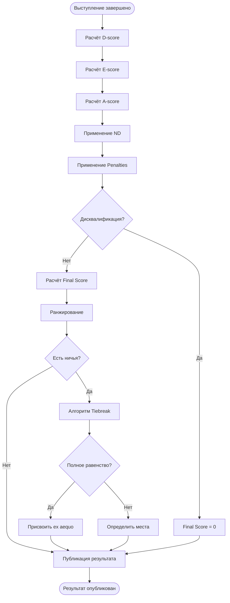

# Алгоритм расчёта оценок
## Система управления соревнованиями по художественной гимнастике

> **Версия:** 1.0
> **Дата:** 2025-11-26
> **Стандарт:** FIG Code of Points 2025-2028

---

## Содержание

1. [Обзор системы оценивания](#обзор-системы-оценивания)
2. [Алгоритм расчёта D-score](#алгоритм-расчёта-d-score)
3. [Алгоритм расчёта E-score](#алгоритм-расчёта-e-score)
4. [Алгоритм расчёта A-score](#алгоритм-расчёта-a-score)
5. [Применение нейтральных сбавок (ND)](#применение-нейтральных-сбавок-nd)
6. [Применение штрафов (Penalties)](#применение-штрафов-penalties)
7. [Расчёт итоговой оценки (Final Score)](#расчёт-итоговой-оценки-final-score)
8. [Алгоритм разрешения ничьей (Tiebreak)](#алгоритм-разрешения-ничьей-tiebreak)
9. [Ранжирование участников](#ранжирование-участников)
10. [Примеры расчётов](#примеры-расчётов)

---

## Обзор системы оценивания

### Формула итоговой оценки

```
Final Score = D-score + E-score + A-score - ND - Penalties
```

Где:
- **D-score** — оценка сложности (Difficulty)
- **E-score** — оценка исполнения (Execution)
- **A-score** — артистическая оценка (Artistry)
- **ND** — нейтральные сбавки (Neutral Deductions)
- **Penalties** — штрафы

### Судейские бригады

| Бригада | Количество судей | Оценивает | Выставляет |
|---------|------------------|-----------|------------|
| **D-Panel** | 4 | Сложность элементов | D-score |
| **E-Panel** | 4-6 | Качество исполнения | E-score |
| **A-Panel** | 4 | Артистизм | A-score |
| **Line Judges** | 2-4 | Выход за ковёр, потери предмета | ND |

---

## Алгоритм расчёта D-score

### Псевдокод

```python
def calculate_d_score(routine_elements):
    """
    Расчёт D-score (оценка сложности)

    Параметры:
        routine_elements: список элементов выступления

    Возвращает:
        d_score: итоговая оценка сложности
    """

    # Компоненты D-score
    DB = 0.0  # Body Difficulty (сложность элементов тела)
    DA = 0.0  # Apparatus Difficulty (сложность работы с предметом)
    DS = 0.0  # Dance Steps (танцевальные шаги)
    DD = 0.0  # Dynamic Elements with Rotation (динамические элементы)

    # 1. Подсчёт Body Difficulty (DB)
    # Максимум 18 элементов тела
    body_elements = filter_by_type(routine_elements, "body")
    body_elements_sorted = sort_by_difficulty_desc(body_elements)

    for i in range(min(18, len(body_elements_sorted))):
        element = body_elements_sorted[i]
        DB += element.difficulty_value  # 0.1 - 0.7

    # 2. Подсчёт Apparatus Difficulty (DA)
    # Максимум 6 элементов с предметом
    apparatus_elements = filter_by_type(routine_elements, "apparatus")
    apparatus_elements_sorted = sort_by_difficulty_desc(apparatus_elements)

    for i in range(min(6, len(apparatus_elements_sorted))):
        element = apparatus_elements_sorted[i]
        DA += element.difficulty_value  # 0.2 - 0.6

    # 3. Подсчёт Dance Steps (DS)
    # Требуется 2 серии танцевальных шагов
    dance_series = filter_by_type(routine_elements, "dance_steps")

    for i in range(min(2, len(dance_series))):
        series = dance_series[i]
        if series.meets_requirements():  # Проверка минимальных требований
            DS += series.difficulty_value  # 0.1 - 0.2

    # 4. Подсчёт Dynamic Elements with Rotation (DD)
    # Требуется минимум 2 динамических элемента
    dynamic_elements = filter_by_type(routine_elements, "dynamic")
    dynamic_elements_sorted = sort_by_difficulty_desc(dynamic_elements)

    for i in range(min(2, len(dynamic_elements_sorted))):
        element = dynamic_elements_sorted[i]
        if element.has_rotation() and element.meets_requirements():
            DD += element.difficulty_value  # 0.2 - 1.0

    # Итоговый D-score
    d_score = DB + DA + DS + DD

    return {
        "d_score": round(d_score, 2),
        "breakdown": {
            "DB": round(DB, 2),
            "DA": round(DA, 2),
            "DS": round(DS, 2),
            "DD": round(DD, 2)
        }
    }
```

### Примечания

- D-score **не ограничен** сверху (теоретически может быть >20.0)
- Элементы должны быть **корректно выполнены**, иначе не засчитываются
- D-судьи работают **независимо**, затем их оценки сравниваются

---

## Алгоритм расчёта E-score

### Псевдокод

```python
def calculate_e_score(judge_deductions):
    """
    Расчёт E-score (оценка исполнения)
    Метод: исключение крайних значений

    Параметры:
        judge_deductions: список сбавок от каждого судьи E-панели

    Возвращает:
        e_score: итоговая оценка исполнения (10.0 - средние сбавки)
    """

    # Начальная оценка
    BASE_SCORE = 10.0

    # Минимальное количество судей
    MIN_JUDGES = 4

    if len(judge_deductions) < MIN_JUDGES:
        raise ValueError(f"Требуется минимум {MIN_JUDGES} судей E-панели")

    # 1. Сортировка сбавок
    sorted_deductions = sorted(judge_deductions)

    # 2. Исключение крайних значений
    # Убираем максимум и минимум
    if len(sorted_deductions) >= 4:
        # Удаляем минимальное и максимальное значение
        middle_deductions = sorted_deductions[1:-1]
    else:
        middle_deductions = sorted_deductions

    # 3. Расчёт среднего арифметического оставшихся сбавок
    average_deductions = sum(middle_deductions) / len(middle_deductions)

    # 4. Итоговая E-score
    e_score = BASE_SCORE - average_deductions

    return {
        "e_score": round(e_score, 3),
        "average_deductions": round(average_deductions, 3),
        "all_deductions": judge_deductions,
        "excluded": [sorted_deductions[0], sorted_deductions[-1]],
        "used": middle_deductions
    }


def calculate_judge_deductions(errors):
    """
    Подсчёт сбавок одного судьи E-панели

    Параметры:
        errors: список ошибок, замеченных судьёй

    Возвращает:
        total_deductions: общая сумма сбавок
    """

    total_deductions = 0.0

    for error in errors:
        if error.type == "small":
            total_deductions += 0.10
        elif error.type == "medium":
            total_deductions += 0.30
        elif error.type == "large":
            total_deductions += 0.50
        else:
            # Неизвестный тип ошибки
            raise ValueError(f"Unknown error type: {error.type}")

    return round(total_deductions, 2)
```

### Примеры сбавок E-панели

| Ошибка | Сбавка |
|--------|--------|
| Мелкая ошибка баланса | -0.10 |
| Средняя ошибка в элементе | -0.30 |
| Серьёзная ошибка / падение элемента | -0.50 |

---

## Алгоритм расчёта A-score

### Псевдокод

```python
def calculate_a_score(judge_scores):
    """
    Расчёт A-score (артистическая оценка)
    Метод: среднее арифметическое всех судей

    Параметры:
        judge_scores: список оценок от судей A-панели (0.0 - 10.0)

    Возвращает:
        a_score: итоговая артистическая оценка
    """

    # Минимальное количество судей
    MIN_JUDGES = 4

    if len(judge_scores) < MIN_JUDGES:
        raise ValueError(f"Требуется минимум {MIN_JUDGES} судей A-панели")

    # Валидация оценок (должны быть в диапазоне 0.0 - 10.0)
    for score in judge_scores:
        if not (0.0 <= score <= 10.0):
            raise ValueError(f"Оценка {score} вне допустимого диапазона [0.0, 10.0]")

    # Расчёт среднего арифметического
    average_score = sum(judge_scores) / len(judge_scores)

    return {
        "a_score": round(average_score, 3),
        "judge_scores": judge_scores
    }


def calculate_artistry_components(performance):
    """
    Оценка артистических компонентов (для одного судьи A-панели)

    Параметры:
        performance: данные о выступлении

    Возвращает:
        artistry_score: оценка артистизма (0.0 - 10.0)
    """

    # Компоненты артистической оценки
    choreography = evaluate_choreography(performance)       # 0-3
    musicality = evaluate_musicality(performance)           # 0-3
    expression = evaluate_expression(performance)           # 0-2
    creativity = evaluate_creativity(performance)           # 0-2

    # Максимум 10 баллов
    total = choreography + musicality + expression + creativity

    return min(total, 10.0)
```

---

## Применение нейтральных сбавок (ND)

### Псевдокод

```python
def calculate_neutral_deductions(violations):
    """
    Расчёт нейтральных сбавок

    Параметры:
        violations: список нарушений

    Возвращает:
        total_nd: общая сумма нейтральных сбавок
    """

    total_nd = 0.0
    deduction_list = []

    for violation in violations:
        deduction = 0.0

        if violation.type == "out_of_bounds":
            if violation.count == 1:
                deduction = 0.30  # Первый выход
            else:
                deduction = 0.50  # Повторные выходы

        elif violation.type == "apparatus_out":
            deduction = 0.70  # Потеря предмета за ковром

        elif violation.type == "fall":
            deduction = 1.00  # Падение гимнастки

        elif violation.type == "time_overtime":
            # Превышение времени: -0.05 за каждую секунду
            deduction = 0.05 * violation.seconds_over

        elif violation.type == "time_undertime":
            # Недостаток времени: -0.05 за каждую секунду
            deduction = 0.05 * violation.seconds_under

        total_nd += deduction
        deduction_list.append({
            "type": violation.type,
            "deduction": deduction,
            "description": violation.description
        })

    return {
        "total_nd": round(total_nd, 2),
        "deductions": deduction_list
    }
```

### Таблица нейтральных сбавок

| Нарушение | Первое | Повторное |
|-----------|--------|-----------|
| Выход за ковёр | -0.30 | -0.50 |
| Потеря предмета за ковром | -0.70 | -0.70 |
| Падение гимнастки | -1.00 | -1.00 |
| Превышение/недостаток времени | -0.05/сек | -0.05/сек |

---

## Применение штрафов (Penalties)

### Псевдокод

```python
def calculate_penalties(infractions):
    """
    Расчёт штрафов

    Параметры:
        infractions: список нарушений правил

    Возвращает:
        total_penalties: общая сумма штрафов
    """

    total_penalties = 0.0
    penalty_list = []

    for infraction in infractions:
        penalty = 0.0

        if infraction.type == "forbidden_element":
            penalty = 0.50  # Запрещённый элемент

        elif infraction.type == "costume_violation":
            penalty = 0.30  # Нарушение костюма

        elif infraction.type == "unauthorized_assistance":
            penalty = 0.30  # Неразрешённая помощь

        elif infraction.type == "improper_music":
            penalty = 0.50  # Недопустимая музыка

        elif infraction.type == "unsportsmanlike_conduct":
            penalty = 0.30  # Неспортивное поведение
            # В серьёзных случаях может быть дисквалификация
            if infraction.severity == "severe":
                return {"disqualified": True, "reason": infraction.description}

        total_penalties += penalty
        penalty_list.append({
            "type": infraction.type,
            "penalty": penalty,
            "description": infraction.description
        })

    return {
        "total_penalties": round(total_penalties, 2),
        "penalties": penalty_list,
        "disqualified": False
    }
```

---

## Расчёт итоговой оценки (Final Score)

### Псевдокод

```python
def calculate_final_score(routine_data):
    """
    Расчёт итоговой оценки выступления

    Параметры:
        routine_data: все данные о выступлении

    Возвращает:
        final_result: итоговая оценка и детали
    """

    # 1. Расчёт D-score
    d_result = calculate_d_score(routine_data.elements)
    d_score = d_result["d_score"]

    # 2. Расчёт E-score
    e_judge_deductions = []
    for judge in routine_data.e_panel_judges:
        deductions = calculate_judge_deductions(judge.errors)
        e_judge_deductions.append(deductions)

    e_result = calculate_e_score(e_judge_deductions)
    e_score = e_result["e_score"]

    # 3. Расчёт A-score
    a_judge_scores = [judge.artistry_score for judge in routine_data.a_panel_judges]
    a_result = calculate_a_score(a_judge_scores)
    a_score = a_result["a_score"]

    # 4. Нейтральные сбавки
    nd_result = calculate_neutral_deductions(routine_data.violations)
    nd = nd_result["total_nd"]

    # 5. Штрафы
    penalty_result = calculate_penalties(routine_data.infractions)

    # Проверка на дисквалификацию
    if penalty_result.get("disqualified", False):
        return {
            "disqualified": True,
            "reason": penalty_result["reason"],
            "final_score": 0.0
        }

    penalties = penalty_result["total_penalties"]

    # 6. Итоговый расчёт
    final_score = d_score + e_score + a_score - nd - penalties

    return {
        "final_score": round(final_score, 3),
        "breakdown": {
            "d_score": d_score,
            "e_score": e_score,
            "a_score": a_score,
            "neutral_deductions": nd,
            "penalties": penalties
        },
        "formula": f"{d_score} + {e_score} + {a_score} - {nd} - {penalties} = {final_score}",
        "details": {
            "d_breakdown": d_result["breakdown"],
            "e_details": e_result,
            "a_details": a_result,
            "nd_details": nd_result,
            "penalty_details": penalty_result
        },
        "disqualified": False
    }
```

---

## Алгоритм разрешения ничьей (Tiebreak)

### Псевдокод

```python
def resolve_tiebreak(athlete1, athlete2):
    """
    Разрешение ничьей при одинаковых итоговых баллах

    Параметры:
        athlete1, athlete2: данные спортсменок с одинаковым final_score

    Возвращает:
        winner: спортсменка с более высоким местом
        reason: причина решения
    """

    # Правило 1: Сравнить E-score
    if athlete1.e_score > athlete2.e_score:
        return {
            "winner": athlete1,
            "reason": "Higher E-score",
            "comparison": f"{athlete1.e_score} > {athlete2.e_score}"
        }
    elif athlete2.e_score > athlete1.e_score:
        return {
            "winner": athlete2,
            "reason": "Higher E-score",
            "comparison": f"{athlete2.e_score} > {athlete1.e_score}"
        }

    # Правило 2: Если E-score равны, сравнить D-score
    if athlete1.d_score > athlete2.d_score:
        return {
            "winner": athlete1,
            "reason": "Higher D-score (E-scores tied)",
            "comparison": f"{athlete1.d_score} > {athlete2.d_score}"
        }
    elif athlete2.d_score > athlete1.d_score:
        return {
            "winner": athlete2,
            "reason": "Higher D-score (E-scores tied)",
            "comparison": f"{athlete2.d_score} > {athlete1.d_score}"
        }

    # Правило 3: Если D-score тоже равны, сравнить A-score
    if athlete1.a_score > athlete2.a_score:
        return {
            "winner": athlete1,
            "reason": "Higher A-score (E and D-scores tied)",
            "comparison": f"{athlete1.a_score} > {athlete2.a_score}"
        }
    elif athlete2.a_score > athlete1.a_score:
        return {
            "winner": athlete2,
            "reason": "Higher A-score (E and D-scores tied)",
            "comparison": f"{athlete2.a_score} > {athlete1.a_score}"
        }

    # Правило 4: Если все компоненты равны — ex aequo (равное место)
    return {
        "winner": None,
        "reason": "Ex aequo (all components equal)",
        "result": "tied"
    }
```

---

## Ранжирование участников

### Псевдокод

```python
def rank_athletes(athletes):
    """
    Ранжирование всех участников группы

    Параметры:
        athletes: список спортсменок с итоговыми оценками

    Возвращает:
        ranked_athletes: отсортированный список с местами
    """

    # 1. Сортировка по убыванию итоговой оценки
    sorted_athletes = sorted(athletes, key=lambda a: a.final_score, reverse=True)

    ranked_athletes = []
    current_rank = 1
    i = 0

    while i < len(sorted_athletes):
        athlete = sorted_athletes[i]
        tied_group = [athlete]

        # 2. Найти всех спортсменок с таким же баллом
        j = i + 1
        while j < len(sorted_athletes) and sorted_athletes[j].final_score == athlete.final_score:
            tied_group.append(sorted_athletes[j])
            j += 1

        # 3. Если есть ничья, применить правила tiebreak
        if len(tied_group) > 1:
            # Разрешение ничьей
            tied_sorted = resolve_ties_in_group(tied_group)

            for k, tied_athlete in enumerate(tied_sorted):
                if tied_athlete.get("ex_aequo", False):
                    # Ex aequo — одинаковое место
                    tied_athlete.rank = current_rank
                    tied_athlete.rank_display = f"{current_rank} (ex aequo)"
                else:
                    tied_athlete.rank = current_rank + k
                    tied_athlete.rank_display = str(current_rank + k)

                ranked_athletes.append(tied_athlete)

            current_rank += len(tied_group)
        else:
            # Нет ничьей
            athlete.rank = current_rank
            athlete.rank_display = str(current_rank)
            ranked_athletes.append(athlete)
            current_rank += 1

        i = j

    return ranked_athletes


def resolve_ties_in_group(tied_athletes):
    """
    Разрешение ничьей в группе из 2+ спортсменок
    """

    # Применяем алгоритм tiebreak попарно
    # Сортируем по E-score, затем по D-score, затем по A-score

    sorted_group = sorted(tied_athletes, key=lambda a: (
        a.e_score,
        a.d_score,
        a.a_score
    ), reverse=True)

    # Проверяем, остались ли полностью равные оценки
    final_group = []
    for athlete in sorted_group:
        # Если все компоненты одинаковы — отмечаем как ex aequo
        if len(final_group) > 0:
            last = final_group[-1]
            if (athlete.e_score == last.e_score and
                athlete.d_score == last.d_score and
                athlete.a_score == last.a_score):
                athlete.ex_aequo = True
                last.ex_aequo = True

        final_group.append(athlete)

    return final_group
```

---

## Примеры расчётов

### Пример 1: Полный расчёт оценки

```python
# Входные данные
routine = {
    "elements": [...],  # Элементы выступления
    "e_panel_judges": [
        {"errors": [{"type": "small"}, {"type": "medium"}]},  # Судья 1: 0.40
        {"errors": [{"type": "small"}, {"type": "medium"}, {"type": "small"}]},  # Судья 2: 0.50
        {"errors": [{"type": "medium"}, {"type": "medium"}]},  # Судья 3: 0.60
        {"errors": [{"type": "small"}, {"type": "medium"}, {"type": "medium"}]},  # Судья 4: 0.70
    ],
    "a_panel_judges": [
        {"artistry_score": 8.5},
        {"artistry_score": 8.7},
        {"artistry_score": 8.6},
        {"artistry_score": 8.4}
    ],
    "violations": [
        {"type": "out_of_bounds", "count": 1}
    ],
    "infractions": []
}

# Расчёт D-score
d_result = {
    "d_score": 9.400,
    "breakdown": {"DB": 5.4, "DA": 2.4, "DS": 0.4, "DD": 1.2}
}

# Расчёт E-score
e_deductions = [0.40, 0.50, 0.60, 0.70]
sorted_deductions = [0.40, 0.50, 0.60, 0.70]
# Исключаем 0.40 (мин) и 0.70 (макс)
middle = [0.50, 0.60]
average = (0.50 + 0.60) / 2 = 0.55
e_score = 10.0 - 0.55 = 9.450

# Расчёт A-score
a_scores = [8.5, 8.7, 8.6, 8.4]
a_score = (8.5 + 8.7 + 8.6 + 8.4) / 4 = 8.55

# Нейтральные сбавки
nd = 0.30  # Один выход за ковёр

# Штрафы
penalties = 0.00

# Итоговая оценка
final_score = 9.400 + 9.450 + 8.55 - 0.30 - 0.00 = 27.100
```

**Результат:** Final Score = **27.100**

---

### Пример 2: Разрешение ничьей

```python
# Две спортсменки с одинаковым итоговым баллом
athlete_a = {
    "name": "Алина Кабаева",
    "final_score": 26.500,
    "d_score": 9.200,
    "e_score": 8.700,
    "a_score": 8.600
}

athlete_b = {
    "name": "Яна Батыршина",
    "final_score": 26.500,
    "d_score": 9.400,
    "e_score": 8.500,
    "a_score": 8.600
}

# Применяем алгоритм tiebreak
result = resolve_tiebreak(athlete_a, athlete_b)

# Результат:
# winner: athlete_a
# reason: "Higher E-score"
# comparison: "8.700 > 8.500"
```

**Итог:** Алина Кабаева занимает более высокое место, т.к. E-score выше.

---

### Пример 3: Ex aequo (равное место)

```python
athlete_a = {
    "final_score": 25.000,
    "d_score": 9.000,
    "e_score": 8.000,
    "a_score": 8.000
}

athlete_b = {
    "final_score": 25.000,
    "d_score": 9.000,
    "e_score": 8.000,
    "a_score": 8.000
}

result = resolve_tiebreak(athlete_a, athlete_b)

# Результат:
# winner: None
# reason: "Ex aequo (all components equal)"
# result: "tied"
```

**Итог:** Обеим спортсменкам присваивается одинаковое место (ex aequo).

---

## Диаграмма потока расчёта



---

## Валидация и проверки

### Контрольные проверки системы

```python
def validate_scores(final_result):
    """
    Валидация расчётов перед публикацией
    """

    errors = []

    # 1. Проверка диапазонов
    if final_result["d_score"] < 0 or final_result["d_score"] > 25:
        errors.append("D-score вне ожидаемого диапазона [0, 25]")

    if final_result["e_score"] < 0 or final_result["e_score"] > 10:
        errors.append("E-score вне допустимого диапазона [0, 10]")

    if final_result["a_score"] < 0 or final_result["a_score"] > 10:
        errors.append("A-score вне допустимого диапазона [0, 10]")

    # 2. Проверка логичности итоговой оценки
    calculated_final = (
        final_result["d_score"] +
        final_result["e_score"] +
        final_result["a_score"] -
        final_result["neutral_deductions"] -
        final_result["penalties"]
    )

    if abs(calculated_final - final_result["final_score"]) > 0.01:
        errors.append(f"Несоответствие расчёта: {calculated_final} != {final_result['final_score']}")

    # 3. Проверка наличия всех оценок
    if final_result["d_score"] is None:
        errors.append("D-score не рассчитан")

    if final_result["e_score"] is None:
        errors.append("E-score не рассчитан")

    if final_result["a_score"] is None:
        errors.append("A-score не рассчитан")

    if len(errors) > 0:
        return {"valid": False, "errors": errors}

    return {"valid": True}
```

---

**Конец документа**

> **Источник:** FIG Code of Points 2025-2028
> **Реализация:** Должна строго соответствовать этим алгоритмам
