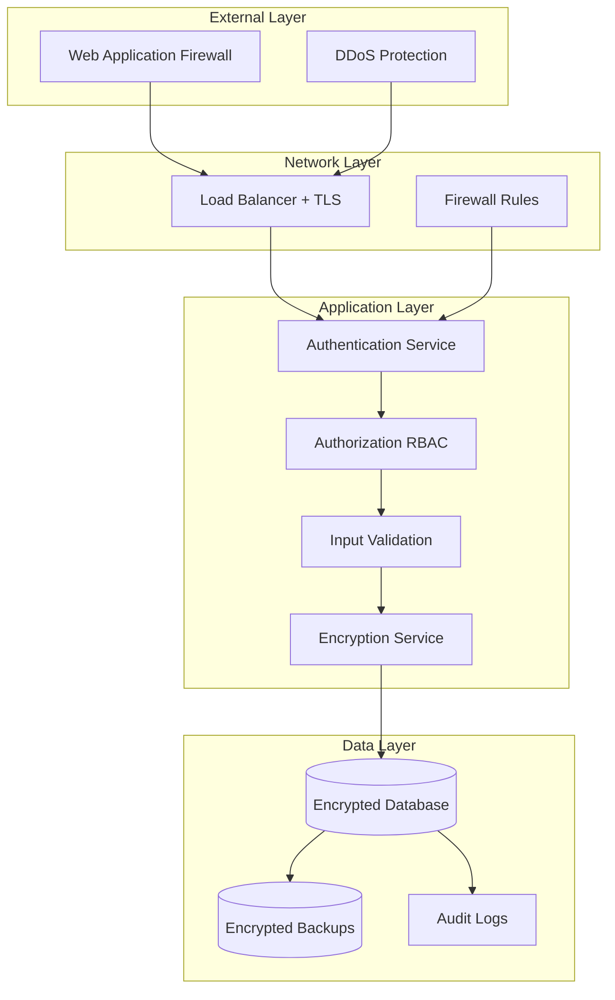

# Security Specification
## RG System - Rhythmic Gymnastics Competition Management System

> **Version:** 2.7
> **Date:** 2025-11-27
> **Status:** Production Ready
> **Classification:** Internal Use

---

## Table of Contents

1. [Security Overview](#security-overview)
2. [Authentication](#authentication)
3. [Authorization](#authorization)
4. [Data Protection](#data-protection)
5. [Application Security](#application-security)
6. [API Security](#api-security)
7. [Infrastructure Security](#infrastructure-security)
8. [Network Security](#network-security)
9. [Monitoring & Incident Response](#monitoring--incident-response)
10. [Compliance & Privacy](#compliance--privacy)
11. [Security Testing](#security-testing)
12. [Security Best Practices](#security-best-practices)

---

## Security Overview

### Security Principles

RG System follows industry-standard security principles:

1. **Defense in Depth** - Multiple layers of security controls
2. **Least Privilege** - Minimum necessary access rights
3. **Fail Secure** - System fails to a secure state
4. **Separation of Duties** - Critical operations require multiple actors
5. **Zero Trust** - Verify every request, never assume trust

### Security Architecture



### Threat Model

**Identified Threats:**

| Threat | Impact | Likelihood | Mitigation |
|--------|--------|------------|------------|
| SQL Injection | High | Medium | Parameterized queries, ORM, input validation |
| XSS (Cross-Site Scripting) | High | Medium | Output encoding, CSP headers, sanitization |
| CSRF (Cross-Site Request Forgery) | Medium | Low | CSRF tokens, SameSite cookies |
| Authentication Bypass | Critical | Low | MFA, rate limiting, session management |
| Authorization Bypass | High | Low | RBAC enforcement, principle of least privilege |
| Data Breach | Critical | Low | Encryption, access controls, monitoring |
| DDoS Attack | Medium | Medium | Rate limiting, CDN, load balancing |
| Man-in-the-Middle | High | Low | TLS 1.3, certificate pinning |
| Session Hijacking | High | Low | Secure cookies, session timeout |
| Privilege Escalation | High | Low | Role validation, audit logging |

---

## Authentication

### Password Security

#### Password Requirements

```typescript
interface PasswordPolicy {
  minLength: 12;
  maxLength: 128;
  requireUppercase: true;
  requireLowercase: true;
  requireDigits: true;
  requireSpecialChars: true;
  preventCommonPasswords: true;
  preventUserInfo: true; // No username, email in password
  passwordHistory: 5; // Cannot reuse last 5 passwords
  maxAge: 90; // Force change every 90 days
}
```

**Validation Regex:**
```regex
^(?=.*[a-z])(?=.*[A-Z])(?=.*\d)(?=.*[@$!%*?&#])[A-Za-z\d@$!%*?&#]{12,128}$
```

**Common Password Check:**
```typescript
const commonPasswords = [
  'password123', '12345678', 'qwerty123',
  'admin123', 'welcome123', 'Password1!'
  // ... load from file with 10,000+ common passwords
];

function isCommonPassword(password: string): boolean {
  return commonPasswords.includes(password.toLowerCase());
}
```

#### Password Hashing

**Algorithm:** bcrypt with cost factor 12

```typescript
import bcrypt from 'bcrypt';

const SALT_ROUNDS = 12;

async function hashPassword(plainPassword: string): Promise<string> {
  // Generate salt and hash in one step
  const hashedPassword = await bcrypt.hash(plainPassword, SALT_ROUNDS);
  return hashedPassword;
}

async function verifyPassword(
  plainPassword: string,
  hashedPassword: string
): Promise<boolean> {
  return await bcrypt.compare(plainPassword, hashedPassword);
}
```

**Why bcrypt:**
- Adaptive: cost factor can be increased as hardware improves
- Salted: automatic unique salt for each password
- Slow: intentionally slow to prevent brute force attacks
- Industry standard: widely tested and recommended

**Alternative (Future):** Argon2id (winner of Password Hashing Competition)

### JWT Token Security

#### Access Token

```typescript
interface AccessTokenPayload {
  user_id: string;
  email: string;
  roles: string[]; // ['judge', 'organizer']
  permissions: string[]; // ['scores:write', 'competitions:read']
  session_id: string;
  iat: number; // Issued at
  exp: number; // Expiration (15 minutes)
  jti: string; // JWT ID (unique identifier)
}

const accessTokenConfig = {
  algorithm: 'RS256', // Asymmetric encryption
  expiresIn: '15m',
  issuer: 'rgsystem-api',
  audience: 'rgsystem-clients'
};
```

#### Refresh Token

```typescript
interface RefreshTokenPayload {
  user_id: string;
  session_id: string;
  iat: number;
  exp: number; // Expiration (7 days)
  jti: string;
}

const refreshTokenConfig = {
  algorithm: 'RS256',
  expiresIn: '7d',
  issuer: 'rgsystem-api',
  audience: 'rgsystem-clients'
};
```

#### Token Storage

**Access Token:**
- **Client-side:** Memory (JavaScript variable)
- **Do NOT store in:** localStorage (XSS vulnerable)
- **Do NOT store in:** sessionStorage (XSS vulnerable)

**Refresh Token:**
- **Client-side:** HttpOnly, Secure, SameSite cookie
- **Server-side:** Redis with TTL

```typescript
// Setting refresh token cookie
res.cookie('refresh_token', refreshToken, {
  httpOnly: true,      // Cannot be accessed via JavaScript
  secure: true,        // Only sent over HTTPS
  sameSite: 'strict',  // CSRF protection
  maxAge: 7 * 24 * 60 * 60 * 1000, // 7 days
  path: '/api/auth/refresh', // Only sent to refresh endpoint
  domain: '.rgsystem.local' // Subdomain support
});
```

#### Token Rotation

```typescript
async function refreshAccessToken(refreshToken: string) {
  // 1. Verify refresh token
  const payload = jwt.verify(refreshToken, PUBLIC_KEY);

  // 2. Check if token is blacklisted
  const isBlacklisted = await redis.get(`blacklist:${payload.jti}`);
  if (isBlacklisted) {
    throw new Error('Token has been revoked');
  }

  // 3. Validate session exists
  const session = await redis.get(`session:${payload.session_id}`);
  if (!session) {
    throw new Error('Session expired');
  }

  // 4. Generate new access token
  const newAccessToken = generateAccessToken(payload.user_id);

  // 5. Generate new refresh token (token rotation)
  const newRefreshToken = generateRefreshToken(payload.user_id, payload.session_id);

  // 6. Blacklist old refresh token
  await redis.setex(
    `blacklist:${payload.jti}`,
    7 * 24 * 60 * 60, // 7 days
    '1'
  );

  return { accessToken: newAccessToken, refreshToken: newRefreshToken };
}
```

### Multi-Factor Authentication (2FA)

#### TOTP (Time-based One-Time Password)

**Setup Flow:**

```typescript
import speakeasy from 'speakeasy';
import QRCode from 'qrcode';

async function setup2FA(userId: string) {
  // 1. Generate secret
  const secret = speakeasy.generateSecret({
    name: `RG System (${userEmail})`,
    issuer: 'RG System',
    length: 32
  });

  // 2. Store secret (encrypted) in database
  await db.users.update(userId, {
    totp_secret: encrypt(secret.base32),
    totp_enabled: false // Not enabled until verified
  });

  // 3. Generate QR code for authenticator app
  const qrCodeUrl = await QRCode.toDataURL(secret.otpauth_url);

  return {
    secret: secret.base32, // Show once, for manual entry
    qrCode: qrCodeUrl,
    backupCodes: generateBackupCodes() // 10 single-use codes
  };
}

function verify2FA(userId: string, token: string): boolean {
  const user = await db.users.findById(userId);
  const secret = decrypt(user.totp_secret);

  const verified = speakeasy.totp.verify({
    secret: secret,
    encoding: 'base32',
    token: token,
    window: 2 // Allow 2 time steps (60 seconds) variance
  });

  if (verified && !user.totp_enabled) {
    // First successful verification, enable 2FA
    await db.users.update(userId, { totp_enabled: true });
  }

  return verified;
}

function generateBackupCodes(): string[] {
  const codes = [];
  for (let i = 0; i < 10; i++) {
    // Generate 8-character alphanumeric code
    codes.push(crypto.randomBytes(4).toString('hex').toUpperCase());
  }
  return codes;
}
```

**Login Flow with 2FA:**

```typescript
async function loginWith2FA(email: string, password: string, totpToken?: string) {
  // 1. Verify email and password
  const user = await db.users.findByEmail(email);
  if (!user || !(await verifyPassword(password, user.password_hash))) {
    throw new UnauthorizedError('Invalid credentials');
  }

  // 2. Check if 2FA is enabled
  if (user.totp_enabled) {
    if (!totpToken) {
      return {
        requires2FA: true,
        tempToken: generateTempToken(user.id) // Valid for 5 minutes
      };
    }

    // 3. Verify TOTP token
    const valid2FA = verify2FA(user.id, totpToken);
    if (!valid2FA) {
      // Check backup codes
      const validBackup = await verifyBackupCode(user.id, totpToken);
      if (!validBackup) {
        throw new UnauthorizedError('Invalid 2FA token');
      }
    }
  }

  // 4. Create session and return tokens
  return createSession(user);
}
```

### Session Management

```typescript
interface Session {
  session_id: string;
  user_id: string;
  created_at: Date;
  last_activity: Date;
  ip_address: string;
  user_agent: string;
  device_fingerprint: string;
  expires_at: Date;
}

const SESSION_CONFIG = {
  maxAge: 7 * 24 * 60 * 60, // 7 days
  inactivityTimeout: 30 * 60, // 30 minutes
  maxConcurrentSessions: 5, // Per user
  requireReauthFor: ['password_change', 'role_change', 'sensitive_action']
};

async function createSession(user: User): Promise<SessionTokens> {
  // 1. Generate session ID
  const sessionId = crypto.randomBytes(32).toString('hex');

  // 2. Store session in Redis
  const session: Session = {
    session_id: sessionId,
    user_id: user.id,
    created_at: new Date(),
    last_activity: new Date(),
    ip_address: req.ip,
    user_agent: req.headers['user-agent'],
    device_fingerprint: generateDeviceFingerprint(req),
    expires_at: new Date(Date.now() + SESSION_CONFIG.maxAge * 1000)
  };

  await redis.setex(
    `session:${sessionId}`,
    SESSION_CONFIG.maxAge,
    JSON.stringify(session)
  );

  // 3. Enforce max concurrent sessions
  await enforceMaxSessions(user.id, sessionId);

  // 4. Generate tokens
  const accessToken = generateAccessToken(user.id, sessionId);
  const refreshToken = generateRefreshToken(user.id, sessionId);

  return { accessToken, refreshToken, sessionId };
}

async function enforceMaxSessions(userId: string, currentSessionId: string) {
  const sessions = await getAllUserSessions(userId);

  if (sessions.length >= SESSION_CONFIG.maxConcurrentSessions) {
    // Remove oldest sessions
    const sortedSessions = sessions.sort((a, b) =>
      a.last_activity.getTime() - b.last_activity.getTime()
    );

    const sessionsToRemove = sortedSessions.slice(
      0,
      sessions.length - SESSION_CONFIG.maxConcurrentSessions + 1
    );

    for (const session of sessionsToRemove) {
      if (session.session_id !== currentSessionId) {
        await redis.del(`session:${session.session_id}`);
      }
    }
  }
}
```

### Account Lockout

```typescript
interface LoginAttempt {
  email: string;
  timestamp: Date;
  ip_address: string;
  success: boolean;
}

const LOCKOUT_CONFIG = {
  maxFailedAttempts: 5,
  lockoutDuration: 30 * 60, // 30 minutes
  trackingWindow: 15 * 60, // 15 minutes
  notifyUser: true
};

async function recordLoginAttempt(
  email: string,
  ipAddress: string,
  success: boolean
) {
  const key = `login_attempts:${email}`;

  // 1. Check if account is locked
  const locked = await redis.get(`account_locked:${email}`);
  if (locked) {
    const ttl = await redis.ttl(`account_locked:${email}`);
    throw new AccountLockedError(`Account locked for ${ttl} seconds`);
  }

  if (!success) {
    // 2. Increment failed attempts
    const attempts = await redis.incr(key);
    await redis.expire(key, LOCKOUT_CONFIG.trackingWindow);

    // 3. Lock account if threshold exceeded
    if (attempts >= LOCKOUT_CONFIG.maxFailedAttempts) {
      await redis.setex(
        `account_locked:${email}`,
        LOCKOUT_CONFIG.lockoutDuration,
        '1'
      );

      // 4. Send notification email
      if (LOCKOUT_CONFIG.notifyUser) {
        await sendAccountLockedEmail(email, ipAddress);
      }

      // 5. Log security event
      await logSecurityEvent({
        type: 'ACCOUNT_LOCKED',
        email,
        ip_address: ipAddress,
        reason: 'Too many failed login attempts'
      });

      throw new AccountLockedError(
        `Account locked due to too many failed attempts. Try again in ${LOCKOUT_CONFIG.lockoutDuration / 60} minutes.`
      );
    }
  } else {
    // Reset failed attempts on successful login
    await redis.del(key);
  }
}
```

---

## Authorization

### Role-Based Access Control (RBAC)

#### Roles and Permissions

```typescript
enum Role {
  ADMIN = 'admin',
  ORGANIZER = 'organizer',
  CHIEF_JUDGE = 'chief_judge',
  JUDGE = 'judge',
  SECRETARY = 'secretary',
  ATHLETE = 'athlete',
  VIEWER = 'viewer'
}

enum Permission {
  // Competition permissions
  COMPETITIONS_CREATE = 'competitions:create',
  COMPETITIONS_READ = 'competitions:read',
  COMPETITIONS_UPDATE = 'competitions:update',
  COMPETITIONS_DELETE = 'competitions:delete',

  // Athlete permissions
  ATHLETES_CREATE = 'athletes:create',
  ATHLETES_READ = 'athletes:read',
  ATHLETES_UPDATE = 'athletes:update',
  ATHLETES_DELETE = 'athletes:delete',

  // Score permissions
  SCORES_CREATE = 'scores:create',
  SCORES_READ = 'scores:read',
  SCORES_UPDATE = 'scores:update',
  SCORES_VALIDATE = 'scores:validate',
  SCORES_CONFIRM = 'scores:confirm',

  // Judge permissions
  JUDGES_ASSIGN = 'judges:assign',
  JUDGES_READ = 'judges:read',

  // Results permissions
  RESULTS_PUBLISH = 'results:publish',
  RESULTS_EXPORT = 'results:export',

  // System permissions
  USERS_MANAGE = 'users:manage',
  SYSTEM_CONFIG = 'system:config',
  AUDIT_LOGS_READ = 'audit:read'
}

const ROLE_PERMISSIONS: Record<Role, Permission[]> = {
  [Role.ADMIN]: [
    // All permissions
    ...Object.values(Permission)
  ],

  [Role.ORGANIZER]: [
    Permission.COMPETITIONS_CREATE,
    Permission.COMPETITIONS_READ,
    Permission.COMPETITIONS_UPDATE,
    Permission.ATHLETES_CREATE,
    Permission.ATHLETES_READ,
    Permission.ATHLETES_UPDATE,
    Permission.JUDGES_ASSIGN,
    Permission.JUDGES_READ,
    Permission.RESULTS_PUBLISH,
    Permission.RESULTS_EXPORT,
    Permission.SCORES_READ
  ],

  [Role.CHIEF_JUDGE]: [
    Permission.COMPETITIONS_READ,
    Permission.ATHLETES_READ,
    Permission.SCORES_READ,
    Permission.SCORES_VALIDATE,
    Permission.SCORES_CONFIRM,
    Permission.JUDGES_READ,
    Permission.RESULTS_EXPORT
  ],

  [Role.JUDGE]: [
    Permission.COMPETITIONS_READ,
    Permission.ATHLETES_READ,
    Permission.SCORES_CREATE,
    Permission.SCORES_READ,
    Permission.SCORES_UPDATE // Only own scores
  ],

  [Role.SECRETARY]: [
    Permission.COMPETITIONS_READ,
    Permission.ATHLETES_READ,
    Permission.SCORES_READ,
    Permission.RESULTS_PUBLISH,
    Permission.RESULTS_EXPORT
  ],

  [Role.ATHLETE]: [
    Permission.COMPETITIONS_READ,
    Permission.ATHLETES_READ, // Only own profile
    Permission.SCORES_READ // Only own scores
  ],

  [Role.VIEWER]: [
    Permission.COMPETITIONS_READ,
    Permission.ATHLETES_READ,
    Permission.SCORES_READ // Only published scores
  ]
};
```

#### Permission Middleware

```typescript
function requirePermission(permission: Permission) {
  return async (req: Request, res: Response, next: NextFunction) => {
    try {
      // 1. Verify JWT token
      const token = extractTokenFromHeader(req);
      const payload = jwt.verify(token, PUBLIC_KEY) as AccessTokenPayload;

      // 2. Check if user has permission
      if (!payload.permissions.includes(permission)) {
        throw new ForbiddenError(
          `Permission denied: ${permission} required`
        );
      }

      // 3. Attach user to request
      req.user = payload;
      next();
    } catch (error) {
      if (error instanceof JsonWebTokenError) {
        return res.status(401).json({
          status: 401,
          code: 'RG-AUTH-UNAUTHORIZED-001',
          message: 'Invalid or expired token'
        });
      }

      if (error instanceof ForbiddenError) {
        return res.status(403).json({
          status: 403,
          code: 'RG-AUTH-FORBIDDEN-001',
          message: error.message
        });
      }

      throw error;
    }
  };
}

// Usage
app.post(
  '/api/competitions',
  requirePermission(Permission.COMPETITIONS_CREATE),
  createCompetitionHandler
);

app.get(
  '/api/audit-logs',
  requirePermission(Permission.AUDIT_LOGS_READ),
  getAuditLogsHandler
);
```

#### Resource-Based Authorization

```typescript
async function canUpdateScore(userId: string, scoreId: string): Promise<boolean> {
  const score = await db.scores.findById(scoreId);
  const user = await db.users.findById(userId);

  // Admin can update any score
  if (user.roles.includes(Role.ADMIN)) {
    return true;
  }

  // Chief Judge can update any score
  if (user.roles.includes(Role.CHIEF_JUDGE)) {
    return true;
  }

  // Judge can only update their own scores
  if (user.roles.includes(Role.JUDGE)) {
    return score.judge_id === userId && score.status !== 'confirmed';
  }

  return false;
}

async function updateScoreHandler(req: Request, res: Response) {
  const { scoreId } = req.params;
  const userId = req.user.user_id;

  // Check resource-level permission
  if (!(await canUpdateScore(userId, scoreId))) {
    return res.status(403).json({
      status: 403,
      code: 'RG-AUTH-FORBIDDEN-002',
      message: 'You do not have permission to update this score'
    });
  }

  // Proceed with update
  // ...
}
```

---

## Data Protection

### Encryption at Rest

#### Database Encryption

**PostgreSQL TDE (Transparent Data Encryption):**

```sql
-- Enable pgcrypto extension
CREATE EXTENSION IF NOT EXISTS pgcrypto;

-- Encrypt sensitive columns
CREATE TABLE users (
  id UUID PRIMARY KEY DEFAULT gen_random_uuid(),
  email VARCHAR(255) UNIQUE NOT NULL,
  password_hash TEXT NOT NULL,

  -- Encrypted fields
  phone_encrypted BYTEA, -- Encrypted phone number
  ssn_encrypted BYTEA,   -- Encrypted SSN/ID number

  created_at TIMESTAMP DEFAULT CURRENT_TIMESTAMP
);

-- Encryption functions
CREATE OR REPLACE FUNCTION encrypt_data(data TEXT, key TEXT)
RETURNS BYTEA AS $$
BEGIN
  RETURN pgp_sym_encrypt(data, key);
END;
$$ LANGUAGE plpgsql;

CREATE OR REPLACE FUNCTION decrypt_data(data BYTEA, key TEXT)
RETURNS TEXT AS $$
BEGIN
  RETURN pgp_sym_decrypt(data, key);
END;
$$ LANGUAGE plpgsql;

-- Usage
INSERT INTO users (email, password_hash, phone_encrypted)
VALUES (
  'user@example.com',
  '$2b$12$...',
  encrypt_data('+1234567890', 'encryption-key-from-env')
);

SELECT
  email,
  decrypt_data(phone_encrypted, 'encryption-key-from-env') as phone
FROM users
WHERE id = 'some-uuid';
```

**Application-Level Encryption:**

```typescript
import crypto from 'crypto';

class EncryptionService {
  private algorithm = 'aes-256-gcm';
  private key: Buffer;

  constructor(masterKey: string) {
    // Derive encryption key from master key
    this.key = crypto.scryptSync(masterKey, 'salt', 32);
  }

  encrypt(plaintext: string): string {
    const iv = crypto.randomBytes(16);
    const cipher = crypto.createCipheriv(this.algorithm, this.key, iv);

    let encrypted = cipher.update(plaintext, 'utf8', 'hex');
    encrypted += cipher.final('hex');

    const authTag = cipher.getAuthTag();

    // Return: iv:authTag:encrypted
    return `${iv.toString('hex')}:${authTag.toString('hex')}:${encrypted}`;
  }

  decrypt(ciphertext: string): string {
    const [ivHex, authTagHex, encrypted] = ciphertext.split(':');

    const iv = Buffer.from(ivHex, 'hex');
    const authTag = Buffer.from(authTagHex, 'hex');
    const decipher = crypto.createDecipheriv(this.algorithm, this.key, iv);

    decipher.setAuthTag(authTag);

    let decrypted = decipher.update(encrypted, 'hex', 'utf8');
    decrypted += decipher.final('utf8');

    return decrypted;
  }
}

// Usage
const encryptionService = new EncryptionService(process.env.ENCRYPTION_MASTER_KEY);

const encryptedPhone = encryptionService.encrypt('+1234567890');
const decryptedPhone = encryptionService.decrypt(encryptedPhone);
```

#### File Storage Encryption

```typescript
import AWS from 'aws-sdk';

const s3 = new AWS.S3({
  accessKeyId: process.env.AWS_ACCESS_KEY_ID,
  secretAccessKey: process.env.AWS_SECRET_ACCESS_KEY,
  region: process.env.AWS_REGION
});

async function uploadEncryptedFile(
  file: Buffer,
  key: string
): Promise<string> {
  const params = {
    Bucket: process.env.S3_BUCKET,
    Key: key,
    Body: file,
    ServerSideEncryption: 'AES256', // S3-managed encryption
    // OR use KMS:
    // ServerSideEncryption: 'aws:kms',
    // SSEKMSKeyId: process.env.KMS_KEY_ID,
    ContentType: 'application/octet-stream',
    ACL: 'private'
  };

  const result = await s3.upload(params).promise();
  return result.Location;
}
```

### Encryption in Transit

#### TLS Configuration

**Nginx TLS Configuration:**

```nginx
server {
    listen 443 ssl http2;
    listen [::]:443 ssl http2;
    server_name rgsystem.local;

    # TLS Certificate
    ssl_certificate /etc/nginx/ssl/cert.pem;
    ssl_certificate_key /etc/nginx/ssl/key.pem;

    # TLS Protocol
    ssl_protocols TLSv1.2 TLSv1.3;
    ssl_prefer_server_ciphers on;

    # Strong Cipher Suites
    ssl_ciphers 'ECDHE-ECDSA-AES128-GCM-SHA256:ECDHE-RSA-AES128-GCM-SHA256:ECDHE-ECDSA-AES256-GCM-SHA384:ECDHE-RSA-AES256-GCM-SHA384';

    # Diffie-Hellman parameter
    ssl_dhparam /etc/nginx/ssl/dhparam.pem;

    # SSL Session
    ssl_session_cache shared:SSL:10m;
    ssl_session_timeout 10m;
    ssl_session_tickets off;

    # OCSP Stapling
    ssl_stapling on;
    ssl_stapling_verify on;
    ssl_trusted_certificate /etc/nginx/ssl/chain.pem;

    # Security Headers
    add_header Strict-Transport-Security "max-age=31536000; includeSubDomains; preload" always;
    add_header X-Frame-Options "SAMEORIGIN" always;
    add_header X-Content-Type-Options "nosniff" always;
    add_header X-XSS-Protection "1; mode=block" always;
    add_header Referrer-Policy "strict-origin-when-cross-origin" always;

    # Content Security Policy
    add_header Content-Security-Policy "default-src 'self'; script-src 'self' 'unsafe-inline' 'unsafe-eval'; style-src 'self' 'unsafe-inline'; img-src 'self' data: https:; font-src 'self'; connect-src 'self' wss://rgsystem.local" always;

    location / {
        proxy_pass http://api_backend;
        proxy_set_header Host $host;
        proxy_set_header X-Real-IP $remote_addr;
        proxy_set_header X-Forwarded-For $proxy_add_x_forwarded_for;
        proxy_set_header X-Forwarded-Proto $scheme;
    }
}

# Redirect HTTP to HTTPS
server {
    listen 80;
    listen [::]:80;
    server_name rgsystem.local;
    return 301 https://$server_name$request_uri;
}
```

#### WebSocket Security

```typescript
import WebSocket from 'ws';

const wss = new WebSocket.Server({
  server: httpsServer, // Must use HTTPS server
  verifyClient: (info, callback) => {
    // 1. Verify origin
    const origin = info.origin || info.req.headers.origin;
    const allowedOrigins = [
      'https://rgsystem.local',
      'https://admin.rgsystem.local'
    ];

    if (!allowedOrigins.includes(origin)) {
      callback(false, 403, 'Forbidden');
      return;
    }

    // 2. Extract and verify JWT token
    const token = extractTokenFromWsRequest(info.req);
    try {
      const payload = jwt.verify(token, PUBLIC_KEY);
      info.req.user = payload;
      callback(true);
    } catch (error) {
      callback(false, 401, 'Unauthorized');
    }
  }
});

wss.on('connection', (ws, req) => {
  const user = req.user;

  ws.on('message', (message) => {
    // Validate and sanitize all incoming messages
    const data = JSON.parse(message);

    // Authorization check
    if (!canPerformAction(user, data.action)) {
      ws.send(JSON.stringify({
        type: 'error',
        message: 'Permission denied'
      }));
      return;
    }

    // Process message
    // ...
  });
});
```

### Data Minimization

**Principles:**

1. **Collect only necessary data**
2. **Retain data only as long as needed**
3. **Delete data when no longer required**

**Implementation:**

```typescript
// Automatic data cleanup job
import cron from 'node-cron';

// Run daily at 2 AM
cron.schedule('0 2 * * *', async () => {
  await cleanupOldData();
});

async function cleanupOldData() {
  const retentionPolicies = {
    audit_logs: 365,        // 1 year
    sessions: 30,           // 30 days
    temp_files: 7,          // 7 days
    deleted_items: 30,      // 30 days (soft delete)
    login_attempts: 90,     // 90 days
    password_reset_tokens: 1 // 1 day
  };

  // Delete old audit logs
  await db.query(`
    DELETE FROM audit_log
    WHERE created_at < NOW() - INTERVAL '${retentionPolicies.audit_logs} days'
  `);

  // Delete expired sessions from Redis
  // (handled automatically by Redis TTL)

  // Delete old temporary files
  await db.query(`
    DELETE FROM temp_files
    WHERE created_at < NOW() - INTERVAL '${retentionPolicies.temp_files} days'
  `);

  // Permanently delete soft-deleted items older than 30 days
  await db.query(`
    DELETE FROM competitions
    WHERE deleted_at IS NOT NULL
    AND deleted_at < NOW() - INTERVAL '${retentionPolicies.deleted_items} days'
  `);

  // Log cleanup activity
  logger.info('Data cleanup completed', {
    timestamp: new Date(),
    records_deleted: {
      audit_logs: auditLogsDeleted,
      temp_files: tempFilesDeleted,
      competitions: competitionsDeleted
    }
  });
}
```

---

## Application Security

### Input Validation

```typescript
import Joi from 'joi';
import validator from 'validator';
import xss from 'xss';

// Request validation schemas
const competitionSchema = Joi.object({
  name: Joi.string()
    .min(3)
    .max(200)
    .required()
    .custom((value) => {
      // Remove any HTML/script tags
      return xss(value, { whiteList: {} });
    }),

  start_date: Joi.date()
    .iso()
    .min('now')
    .required(),

  end_date: Joi.date()
    .iso()
    .greater(Joi.ref('start_date'))
    .required(),

  location: Joi.string()
    .max(500)
    .required(),

  type: Joi.string()
    .valid('individual', 'group', 'mixed')
    .required(),

  level: Joi.string()
    .valid('local', 'regional', 'national', 'international')
    .required()
});

function validateRequest(schema: Joi.Schema) {
  return (req: Request, res: Response, next: NextFunction) => {
    const { error, value } = schema.validate(req.body, {
      abortEarly: false, // Return all errors
      stripUnknown: true // Remove unknown fields
    });

    if (error) {
      const errors = error.details.map(detail => ({
        field: detail.path.join('.'),
        message: detail.message
      }));

      return res.status(400).json({
        status: 400,
        code: 'RG-VALIDATION-ERROR-001',
        message: 'Validation failed',
        errors
      });
    }

    req.body = value; // Use sanitized values
    next();
  };
}

// Usage
app.post(
  '/api/competitions',
  validateRequest(competitionSchema),
  createCompetitionHandler
);
```

### SQL Injection Prevention

```typescript
// ❌ WRONG - Vulnerable to SQL injection
async function getAthleteByName(name: string) {
  const query = `SELECT * FROM athletes WHERE name = '${name}'`;
  return await db.query(query);
}
// Attack: name = "'; DROP TABLE athletes; --"

// ✅ CORRECT - Parameterized query
async function getAthleteByName(name: string) {
  const query = 'SELECT * FROM athletes WHERE name = $1';
  return await db.query(query, [name]);
}

// ✅ CORRECT - Using ORM (Sequelize)
async function getAthleteByName(name: string) {
  return await Athlete.findOne({
    where: { name }
  });
}

// ✅ CORRECT - Using Query Builder (Knex)
async function getAthleteByName(name: string) {
  return await db('athletes')
    .where({ name })
    .first();
}
```

### XSS Prevention

```typescript
import DOMPurify from 'isomorphic-dompurify';
import { escape } from 'html-escaper';

// Server-side sanitization
function sanitizeHtml(html: string): string {
  return DOMPurify.sanitize(html, {
    ALLOWED_TAGS: ['b', 'i', 'em', 'strong', 'a', 'p', 'br'],
    ALLOWED_ATTR: ['href'],
    ALLOW_DATA_ATTR: false
  });
}

// Escape output
function escapeHtml(text: string): string {
  return escape(text);
}

// React automatically escapes JSX expressions
function AthleteProfile({ athlete }) {
  return (
    <div>
      {/* Safe - React escapes by default */}
      <h1>{athlete.name}</h1>

      {/* Dangerous - use only for trusted HTML */}
      <div dangerouslySetInnerHTML={{
        __html: sanitizeHtml(athlete.bio)
      }} />
    </div>
  );
}
```

### CSRF Protection

```typescript
import csrf from 'csurf';
import cookieParser from 'cookie-parser';

app.use(cookieParser());

// CSRF protection middleware
const csrfProtection = csrf({
  cookie: {
    httpOnly: true,
    secure: true, // HTTPS only
    sameSite: 'strict'
  }
});

// Apply to state-changing endpoints
app.post('/api/competitions', csrfProtection, createCompetitionHandler);
app.put('/api/competitions/:id', csrfProtection, updateCompetitionHandler);
app.delete('/api/competitions/:id', csrfProtection, deleteCompetitionHandler);

// Endpoint to get CSRF token
app.get('/api/csrf-token', csrfProtection, (req, res) => {
  res.json({ csrfToken: req.csrfToken() });
});

// Client-side usage
async function createCompetition(data) {
  // 1. Get CSRF token
  const { csrfToken } = await fetch('/api/csrf-token').then(r => r.json());

  // 2. Include token in request
  const response = await fetch('/api/competitions', {
    method: 'POST',
    headers: {
      'Content-Type': 'application/json',
      'X-CSRF-Token': csrfToken
    },
    body: JSON.stringify(data),
    credentials: 'include' // Include cookies
  });

  return response.json();
}
```

### Rate Limiting

```typescript
import rateLimit from 'express-rate-limit';
import RedisStore from 'rate-limit-redis';
import redis from './redis';

// Global rate limit
const globalLimiter = rateLimit({
  store: new RedisStore({
    client: redis,
    prefix: 'rl:global:'
  }),
  windowMs: 15 * 60 * 1000, // 15 minutes
  max: 1000, // 1000 requests per 15 minutes
  message: {
    status: 429,
    code: 'RG-RATE-LIMIT-001',
    message: 'Too many requests, please try again later'
  },
  standardHeaders: true, // Return rate limit info in `RateLimit-*` headers
  legacyHeaders: false
});

// Strict rate limit for authentication endpoints
const authLimiter = rateLimit({
  store: new RedisStore({
    client: redis,
    prefix: 'rl:auth:'
  }),
  windowMs: 15 * 60 * 1000, // 15 minutes
  max: 5, // 5 login attempts per 15 minutes
  skipSuccessfulRequests: true, // Only count failed requests
  message: {
    status: 429,
    code: 'RG-RATE-LIMIT-002',
    message: 'Too many login attempts, please try again later'
  }
});

// API rate limit
const apiLimiter = rateLimit({
  store: new RedisStore({
    client: redis,
    prefix: 'rl:api:'
  }),
  windowMs: 60 * 1000, // 1 minute
  max: 100, // 100 requests per minute
  keyGenerator: (req) => {
    // Rate limit by user ID for authenticated requests
    return req.user?.user_id || req.ip;
  }
});

// Apply limiters
app.use('/api/', globalLimiter);
app.use('/api/auth/login', authLimiter);
app.use('/api/v1/', apiLimiter);
```

---

## API Security

### API Authentication

```typescript
// API Key authentication for external integrations
interface ApiKey {
  key_id: string;
  key_hash: string;
  user_id: string;
  name: string;
  scopes: string[];
  rate_limit: number;
  created_at: Date;
  expires_at: Date;
  last_used_at: Date;
}

async function validateApiKey(apiKey: string): Promise<ApiKey | null> {
  // 1. Hash the provided API key
  const keyHash = crypto
    .createHash('sha256')
    .update(apiKey)
    .digest('hex');

  // 2. Look up in database
  const storedKey = await db.api_keys.findOne({
    where: { key_hash: keyHash }
  });

  if (!storedKey) {
    return null;
  }

  // 3. Check expiration
  if (storedKey.expires_at < new Date()) {
    return null;
  }

  // 4. Update last_used_at
  await db.api_keys.update(storedKey.key_id, {
    last_used_at: new Date()
  });

  return storedKey;
}

// Middleware
async function requireApiKey(req: Request, res: Response, next: NextFunction) {
  const apiKey = req.headers['x-api-key'] as string;

  if (!apiKey) {
    return res.status(401).json({
      status: 401,
      code: 'RG-API-AUTH-001',
      message: 'API key required'
    });
  }

  const validKey = await validateApiKey(apiKey);

  if (!validKey) {
    return res.status(401).json({
      status: 401,
      code: 'RG-API-AUTH-002',
      message: 'Invalid or expired API key'
    });
  }

  req.apiKey = validKey;
  next();
}
```

### API Request Signing

```typescript
// HMAC request signing for sensitive operations
function signRequest(
  method: string,
  path: string,
  body: string,
  timestamp: number,
  secret: string
): string {
  const message = `${method}\n${path}\n${body}\n${timestamp}`;

  return crypto
    .createHmac('sha256', secret)
    .update(message)
    .digest('hex');
}

function verifyRequestSignature(req: Request, secret: string): boolean {
  const signature = req.headers['x-signature'] as string;
  const timestamp = parseInt(req.headers['x-timestamp'] as string);

  // 1. Check timestamp (prevent replay attacks)
  const now = Date.now();
  const maxAge = 5 * 60 * 1000; // 5 minutes

  if (Math.abs(now - timestamp) > maxAge) {
    return false;
  }

  // 2. Compute expected signature
  const body = JSON.stringify(req.body);
  const expectedSignature = signRequest(
    req.method,
    req.path,
    body,
    timestamp,
    secret
  );

  // 3. Compare signatures (timing-safe comparison)
  return crypto.timingSafeEqual(
    Buffer.from(signature),
    Buffer.from(expectedSignature)
  );
}

// Usage
app.post(
  '/api/v1/competitions',
  (req, res, next) => {
    if (!verifyRequestSignature(req, process.env.API_SECRET)) {
      return res.status(401).json({
        status: 401,
        code: 'RG-API-SIG-001',
        message: 'Invalid request signature'
      });
    }
    next();
  },
  createCompetitionHandler
);
```

### API Versioning

```typescript
// URL versioning
app.use('/api/v1', v1Router);
app.use('/api/v2', v2Router);

// Header versioning
app.use('/api', (req, res, next) => {
  const version = req.headers['api-version'] || '1.0';

  if (version === '1.0') {
    v1Router(req, res, next);
  } else if (version === '2.0') {
    v2Router(req, res, next);
  } else {
    res.status(400).json({
      status: 400,
      code: 'RG-API-VERSION-001',
      message: `Unsupported API version: ${version}`
    });
  }
});
```

---

## Infrastructure Security

### Docker Security

```dockerfile
# Use specific versions, not 'latest'
FROM node:18.17.0-alpine3.18

# Create non-root user
RUN addgroup -g 1001 -S nodejs && \
    adduser -S nodejs -u 1001

# Set working directory
WORKDIR /app

# Copy package files
COPY package*.json ./

# Install dependencies (production only)
RUN npm ci --only=production && \
    npm cache clean --force

# Copy application code
COPY --chown=nodejs:nodejs . .

# Remove unnecessary files
RUN rm -rf .git .github docs tests *.md

# Use non-root user
USER nodejs

# Expose port
EXPOSE 3000

# Health check
HEALTHCHECK --interval=30s --timeout=3s --start-period=5s --retries=3 \
  CMD node healthcheck.js

# Start application
CMD ["node", "dist/server.js"]
```

**Docker Compose Security:**

```yaml
version: '3.8'

services:
  api:
    image: rgsystem/api:2.7
    read_only: true  # Read-only filesystem
    security_opt:
      - no-new-privileges:true
    cap_drop:
      - ALL
    cap_add:
      - NET_BIND_SERVICE
    tmpfs:
      - /tmp
    environment:
      - NODE_ENV=production
    secrets:
      - db_password
      - jwt_private_key
    networks:
      - app_network

  postgres:
    image: postgres:14-alpine
    read_only: true
    security_opt:
      - no-new-privileges:true
    environment:
      - POSTGRES_PASSWORD_FILE=/run/secrets/db_password
    secrets:
      - db_password
    volumes:
      - postgres_data:/var/lib/postgresql/data
      - /var/run/postgresql:/var/run/postgresql
    networks:
      - db_network

secrets:
  db_password:
    file: ./secrets/db_password.txt
  jwt_private_key:
    file: ./secrets/jwt_private.pem

networks:
  app_network:
    driver: bridge
  db_network:
    driver: bridge
    internal: true  # No external access

volumes:
  postgres_data:
    driver: local
```

### Secrets Management

```typescript
// Using environment variables with validation
import Joi from 'joi';

const envSchema = Joi.object({
  NODE_ENV: Joi.string().valid('development', 'production', 'test').required(),
  PORT: Joi.number().default(3000),

  // Database
  DB_HOST: Joi.string().required(),
  DB_PORT: Joi.number().default(5432),
  DB_NAME: Joi.string().required(),
  DB_USER: Joi.string().required(),
  DB_PASSWORD: Joi.string().required(),

  // JWT
  JWT_PRIVATE_KEY: Joi.string().required(),
  JWT_PUBLIC_KEY: Joi.string().required(),

  // Encryption
  ENCRYPTION_MASTER_KEY: Joi.string().length(64).required(), // 256-bit hex

  // Redis
  REDIS_HOST: Joi.string().required(),
  REDIS_PORT: Joi.number().default(6379),
  REDIS_PASSWORD: Joi.string().required(),

  // AWS
  AWS_ACCESS_KEY_ID: Joi.string().when('NODE_ENV', {
    is: 'production',
    then: Joi.required()
  }),
  AWS_SECRET_ACCESS_KEY: Joi.string().when('NODE_ENV', {
    is: 'production',
    then: Joi.required()
  })
}).unknown();

const { error, value: env } = envSchema.validate(process.env);

if (error) {
  throw new Error(`Config validation error: ${error.message}`);
}

export default env;
```

**Using HashiCorp Vault (for production):**

```typescript
import Vault from 'node-vault';

const vault = Vault({
  apiVersion: 'v1',
  endpoint: process.env.VAULT_ADDR,
  token: process.env.VAULT_TOKEN
});

async function getSecret(path: string): Promise<any> {
  const result = await vault.read(path);
  return result.data;
}

// Usage
const dbPassword = await getSecret('secret/database/password');
const jwtKeys = await getSecret('secret/jwt/keys');
```

---

## Monitoring & Incident Response

### Security Monitoring

```typescript
import winston from 'winston';
import { ElasticsearchTransport } from 'winston-elasticsearch';

const logger = winston.createLogger({
  level: 'info',
  format: winston.format.json(),
  transports: [
    // Console
    new winston.transports.Console(),

    // File
    new winston.transports.File({
      filename: 'logs/security.log',
      level: 'warn'
    }),

    // Elasticsearch
    new ElasticsearchTransport({
      level: 'info',
      clientOpts: { node: process.env.ELASTICSEARCH_URL },
      index: 'security-logs'
    })
  ]
});

// Security event types
enum SecurityEvent {
  LOGIN_SUCCESS = 'LOGIN_SUCCESS',
  LOGIN_FAILURE = 'LOGIN_FAILURE',
  LOGOUT = 'LOGOUT',
  PASSWORD_CHANGE = 'PASSWORD_CHANGE',
  PERMISSION_DENIED = 'PERMISSION_DENIED',
  ACCOUNT_LOCKED = 'ACCOUNT_LOCKED',
  SUSPICIOUS_ACTIVITY = 'SUSPICIOUS_ACTIVITY',
  API_KEY_CREATED = 'API_KEY_CREATED',
  API_KEY_REVOKED = 'API_KEY_REVOKED',
  DATA_EXPORT = 'DATA_EXPORT',
  CONFIGURATION_CHANGE = 'CONFIGURATION_CHANGE'
}

function logSecurityEvent(event: {
  type: SecurityEvent;
  user_id?: string;
  email?: string;
  ip_address: string;
  user_agent?: string;
  details?: any;
  severity?: 'low' | 'medium' | 'high' | 'critical';
}) {
  logger.warn({
    timestamp: new Date().toISOString(),
    event_type: event.type,
    user_id: event.user_id,
    email: event.email,
    ip_address: event.ip_address,
    user_agent: event.user_agent,
    details: event.details,
    severity: event.severity || 'medium'
  });

  // Send alerts for critical events
  if (event.severity === 'critical') {
    sendSecurityAlert(event);
  }
}
```

### Intrusion Detection

```typescript
// Detect suspicious patterns
async function detectSuspiciousActivity(req: Request) {
  const userId = req.user?.user_id;
  const ipAddress = req.ip;

  // 1. Multiple failed logins
  const failedLogins = await redis.get(`failed_logins:${ipAddress}`);
  if (parseInt(failedLogins || '0') > 10) {
    await logSecurityEvent({
      type: SecurityEvent.SUSPICIOUS_ACTIVITY,
      ip_address: ipAddress,
      details: { reason: 'Multiple failed logins' },
      severity: 'high'
    });
  }

  // 2. Impossible travel (login from different countries within minutes)
  if (userId) {
    const lastLocation = await redis.get(`last_location:${userId}`);
    if (lastLocation) {
      const currentLocation = await getLocationFromIP(ipAddress);
      const distance = calculateDistance(
        JSON.parse(lastLocation),
        currentLocation
      );

      if (distance > 1000) { // 1000 km
        await logSecurityEvent({
          type: SecurityEvent.SUSPICIOUS_ACTIVITY,
          user_id: userId,
          ip_address: ipAddress,
          details: {
            reason: 'Impossible travel detected',
            distance,
            last_location: lastLocation,
            current_location: currentLocation
          },
          severity: 'critical'
        });

        // Force re-authentication
        await invalidateUserSessions(userId);
      }
    }

    await redis.setex(
      `last_location:${userId}`,
      24 * 60 * 60,
      JSON.stringify(currentLocation)
    );
  }

  // 3. Unusual API usage patterns
  const apiCallsLastHour = await redis.incr(`api_calls:${userId}:${getCurrentHour()}`);
  await redis.expire(`api_calls:${userId}:${getCurrentHour()}`, 3600);

  if (apiCallsLastHour > 1000) {
    await logSecurityEvent({
      type: SecurityEvent.SUSPICIOUS_ACTIVITY,
      user_id: userId,
      ip_address: ipAddress,
      details: {
        reason: 'Unusual API usage',
        calls_last_hour: apiCallsLastHour
      },
      severity: 'medium'
    });
  }
}
```

### Incident Response Plan

**Severity Levels:**

| Level | Description | Response Time | Escalation |
|-------|-------------|---------------|------------|
| Low | Minor security event, no immediate risk | 24 hours | Security team |
| Medium | Potential security issue, requires investigation | 4 hours | Security team + Manager |
| High | Confirmed security breach, limited impact | 1 hour | Security team + CTO |
| Critical | Major security breach, widespread impact | 15 minutes | All hands, CEO notified |

**Response Playbook:**

1. **Detection & Alert**
   - Automated monitoring detects anomaly
   - Alert sent to security team via PagerDuty/Slack

2. **Triage**
   - Assess severity level
   - Determine affected systems and data
   - Identify attack vector

3. **Containment**
   - Isolate affected systems
   - Block malicious IPs
   - Revoke compromised credentials
   - Enable enhanced logging

4. **Eradication**
   - Remove malware/unauthorized access
   - Patch vulnerabilities
   - Reset passwords
   - Rotate secrets

5. **Recovery**
   - Restore from backups if needed
   - Gradually bring systems back online
   - Monitor for re-infection

6. **Post-Incident**
   - Document timeline
   - Root cause analysis
   - Update security policies
   - Notify affected users (if required)
   - Regulatory reporting (if required)

---

## Compliance & Privacy

### GDPR Compliance

**Data Subject Rights:**

```typescript
// Right to Access (Article 15)
async function exportUserData(userId: string): Promise<any> {
  const user = await db.users.findById(userId);
  const competitions = await db.competitions.findByUserId(userId);
  const scores = await db.scores.findByUserId(userId);
  const auditLogs = await db.audit_log.findByUserId(userId);

  return {
    personal_data: {
      email: user.email,
      name: user.name,
      created_at: user.created_at,
      last_login: user.last_login_at
    },
    competitions,
    scores,
    audit_logs
  };
}

// Right to Erasure (Article 17)
async function deleteUserData(userId: string) {
  // 1. Anonymize instead of delete (for data integrity)
  await db.users.update(userId, {
    email: `deleted_${userId}@anonymized.local`,
    name: 'Deleted User',
    phone: null,
    deleted_at: new Date()
  });

  // 2. Remove PII from related records
  await db.scores.update(
    { user_id: userId },
    { judge_name: 'Anonymized' }
  );

  // 3. Log the deletion
  await db.audit_log.create({
    action: 'USER_DATA_DELETED',
    user_id: userId,
    timestamp: new Date(),
    reason: 'GDPR Right to Erasure request'
  });
}

// Right to Data Portability (Article 20)
async function exportUserDataPortable(userId: string): Promise<string> {
  const data = await exportUserData(userId);

  // Export as JSON
  return JSON.stringify(data, null, 2);
}
```

### Data Processing Agreement

**Documented Processing Activities:**

| Purpose | Legal Basis | Data Categories | Recipients | Retention |
|---------|-------------|-----------------|-----------|-----------|
| User authentication | Contract | Email, password hash | Internal systems | Account lifetime |
| Competition scoring | Legitimate interest | Names, scores, videos | Judges, organizers | 7 years |
| Analytics | Consent | Usage data, IP address | Analytics service | 2 years |
| Email notifications | Consent | Email, name | Email service | Until consent withdrawn |

### Audit Logging

```sql
CREATE TABLE audit_log (
  id UUID PRIMARY KEY DEFAULT gen_random_uuid(),
  timestamp TIMESTAMP NOT NULL DEFAULT CURRENT_TIMESTAMP,
  user_id UUID REFERENCES users(id),
  action VARCHAR(100) NOT NULL,
  entity_type VARCHAR(50),
  entity_id UUID,
  ip_address INET,
  user_agent TEXT,
  changes JSONB, -- Old and new values
  result VARCHAR(20), -- 'success' or 'failure'
  INDEX idx_audit_timestamp (timestamp),
  INDEX idx_audit_user (user_id),
  INDEX idx_audit_action (action)
);

-- Automatic audit logging trigger
CREATE OR REPLACE FUNCTION audit_trigger_function()
RETURNS TRIGGER AS $$
BEGIN
  INSERT INTO audit_log (
    user_id,
    action,
    entity_type,
    entity_id,
    changes
  ) VALUES (
    current_setting('app.current_user_id', true)::UUID,
    TG_OP,
    TG_TABLE_NAME,
    COALESCE(NEW.id, OLD.id),
    jsonb_build_object(
      'old', to_jsonb(OLD),
      'new', to_jsonb(NEW)
    )
  );

  RETURN NEW;
END;
$$ LANGUAGE plpgsql;

-- Apply to sensitive tables
CREATE TRIGGER audit_users
AFTER INSERT OR UPDATE OR DELETE ON users
FOR EACH ROW EXECUTE FUNCTION audit_trigger_function();

CREATE TRIGGER audit_scores
AFTER INSERT OR UPDATE OR DELETE ON scores
FOR EACH ROW EXECUTE FUNCTION audit_trigger_function();
```

---

## Security Testing

### Penetration Testing Schedule

| Test Type | Frequency | Scope |
|-----------|-----------|-------|
| Automated SAST | Every commit | Source code |
| Automated DAST | Daily | API endpoints |
| Dependency scanning | Weekly | npm packages |
| Manual penetration test | Quarterly | Full application |
| Red team exercise | Annually | Full infrastructure |

### Security Testing Tools

```yaml
# .github/workflows/security.yml
name: Security Scanning

on: [push, pull_request]

jobs:
  sast:
    runs-on: ubuntu-latest
    steps:
      - uses: actions/checkout@v3

      - name: Run Semgrep
        uses: returntocorp/semgrep-action@v1
        with:
          config: p/security-audit

      - name: Run ESLint Security Plugin
        run: |
          npm install
          npm run lint:security

  dependency-check:
    runs-on: ubuntu-latest
    steps:
      - uses: actions/checkout@v3

      - name: Run npm audit
        run: npm audit --audit-level=moderate

      - name: Run Snyk
        uses: snyk/actions/node@master
        env:
          SNYK_TOKEN: ${{ secrets.SNYK_TOKEN }}

  secrets-scan:
    runs-on: ubuntu-latest
    steps:
      - uses: actions/checkout@v3
        with:
          fetch-depth: 0

      - name: Run Gitleaks
        uses: gitleaks/gitleaks-action@v2
```

### Security Checklist

**Pre-deployment:**

- [ ] All dependencies updated to latest secure versions
- [ ] No secrets in source code or environment variables
- [ ] TLS certificates valid and not expiring soon
- [ ] Security headers configured
- [ ] Rate limiting enabled
- [ ] Input validation on all endpoints
- [ ] SQL injection tests passed
- [ ] XSS tests passed
- [ ] CSRF protection enabled
- [ ] Authentication and authorization tests passed
- [ ] Secrets rotated
- [ ] Backup and recovery tested
- [ ] Monitoring and alerting configured
- [ ] Incident response plan reviewed

---

## Security Best Practices

### Development

1. **Never commit secrets** - Use environment variables or secret management
2. **Use parameterized queries** - Prevent SQL injection
3. **Validate all input** - Never trust user input
4. **Escape all output** - Prevent XSS
5. **Use HTTPS everywhere** - Encrypt data in transit
6. **Keep dependencies updated** - Patch vulnerabilities
7. **Follow principle of least privilege** - Minimize permissions
8. **Use strong cryptography** - AES-256, RSA-2048+, bcrypt
9. **Implement logging** - Track security events
10. **Review code for security** - Peer review and automated scanning

### Deployment

1. **Use strong passwords** - Enforce password policy
2. **Enable MFA** - Add extra layer of security
3. **Rotate secrets regularly** - API keys, certificates, passwords
4. **Monitor logs** - Detect anomalies
5. **Keep systems patched** - Apply security updates
6. **Use firewalls** - Restrict network access
7. **Implement backups** - Ensure data recovery
8. **Test disaster recovery** - Validate backup restoration
9. **Conduct security training** - Educate team
10. **Perform security audits** - Regular assessments

---

## Version History

| Version | Date | Changes |
|---------|------|---------|
| 2.7 | 2025-11-27 | Initial security specification |

---

**Document Classification:** Internal Use
**Last Reviewed:** 2025-11-27
**Next Review:** 2026-02-27 (Quarterly)

---

> **Note:** This document contains security-sensitive information and should only be shared with authorized personnel. Any security vulnerabilities discovered should be reported immediately to security@rgsystem.local.
